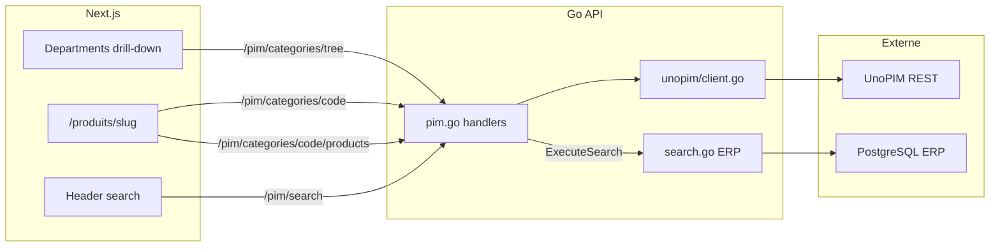

# Intégration UnoPIM — Roadmap

Document de référence pour l'intégration UnoPIM dans la plateforme Midbec.
Source de vérité produit côté PIM, gérée par Patrick.

**Dernière mise à jour :** 16 juillet 2026

**Documentation catalogue (repo back) :** [`midbec-go-api/docs/unopim-catalogue.md`](../../midbec-go-api/docs/unopim-catalogue.md) — structure attributs, familles, catégories, règles SKU, ordre d'import, routes API Go.

**Smoke jour J (repo back) :** [`midbec-go-api/scripts/pim-smoke.sh`](../../midbec-go-api/scripts/pim-smoke.sh) — gate OAuth + checklist curl en ~1 min (`./scripts/pim-smoke.sh` avec API Go démarrée).

**Smoke catalogue ERP interim :** [`midbec-go-api/scripts/erp-catalog-smoke.sh`](../../midbec-go-api/scripts/erp-catalog-smoke.sh) — arbre, catégorie, produits, recherche, fiche SKU.

**Statut infra (16 juillet, PM) :** OAuth UnoPIM bloqué — **cause racine identifiée** via `scripts/pim-oauth-probe.go` : permissions incorrectes sur `oauth-private.key` (`664` au lieu de `600`). Fix serveur : `chmod 600` sur les clés dans `packages/Webkul/AdminApi/src/Secrets/Oauth/` — **action Patrick (SSH `10.10.10.6`)**. Catalogue ERP interim actif (`NEXT_PUBLIC_CATALOG_SOURCE=erp`).

**Décision architecture (16 juillet, Patrick) :** UnoPIM = source de vérité **produits uniquement** ; Ogasys/ERP = prix, stock, comptes, commandes, factures. Aligné avec le modèle dual-source documenté dans `erp-map.md` et `unopim-catalogue.md`.

**Daily log Phase 1 :** [`2026-07-16`](../03%20-%20Daily%20Logs/07%20-%20Juillet%202026/2026-07-16.md)

---

## Contexte

UnoPIM remplace progressivement les données de démo (fake-server) comme source catalogue. L'intégration suit une approche **strangler fig** : domaine par domaine, jamais tout d'un coup.

**Chaîne technique :**

```
Next.js (front) → Go API (Chi) → UnoPIM REST API (OAuth2 Laravel Passport)
```

**Principes récurrents :**

- **UI First** — fake data → validation visuelle → branchement Go API
- **Cache côté Go** — le frontend ne paie jamais le coût de la pagination UnoPIM
- **Un scope = un prompt = un commit**
- Toujours logger l'URL UnoPIM au démarrage de l'API Go

---

## Vue d'ensemble des étapes

| Étape | Scope | Statut | Date |
| --- | --- | --- | --- |
| 0 — Auth & proxy catégories brutes | Scope 10 | ✅ Done | 21–22 mai |
| 0b — Cache catégories racines | Scope 10 | ✅ Done | 25 mai |
| 0c — Catégories racines en UI | Scope 10 | ✅ Done | 26 mai |
| **1 — Arbre catégories & megamenu** | **Scope 11** | **✅ Done** | **28 mai** |
| 2 — Listing produits par catégorie | Scope 12 | ✅ Done | 29 mai |
| 2b — Navigation catalogue unifiée | Scope 12b | ✅ Done | 29 mai |
| **2c — Panneau enfant style Amazon** | **Scope 12c** | **✅ Done** | **29 mai** |
| **2d — Overlay prix ERP cartes catégorie + cohérence B2B** | **Scope 12d** | **✅ Done (code)** — validation données en cours | **9–10 juin** |
| **3 — Recherche header (ERP discovery + UnoPIM)** | **Scope 13** | **✅ Done (code)** — validation données en cours | **1–2 juin** |
| **4 — Remplacement progressif fake data** | **Slice A** | **✅ Done** — slice B reporté (import Patrick) | **4 juin** |
| Cleanup — suppression config statique | — | **✅ Done** | **4 juin** |
| **PartSmart — proxy Go recherche modèle/pièce** | Scope 8 | **✅ Done (code + e2e)** — auth Postman + Go validés 5 juin | **5 juin** |
| **Catalogue ERP interim** | Scope 14a | **✅ Done** — arbre, catégories, produits, recherche | **16 juin** |
| **Fiche produit catalogue E2E** | Scope 14b | **✅ Done** — ERP + PIM endpoints, front SSR, panier | **16–18 juin** |
| **Cleanup legacy shop (Phase 1)** | — | **✅ Done** — Redux shop, pages listing supprimés | **18 juin** |
| **Polish UX catalogue ERP** | Scope 15 | **✅ Done** — title-case, megamenu feuilles | **19 juin** |
| **CI/CD minimal GitLab** | — | **✅ Done** — build front + vet/build back sur MR | **19 juin** |

**Daily logs associés :** [`2026-05-21`](../03%20-%20Daily%20Logs/05%20-%20Mai%202026/2026-05-21.md) · [`2026-05-22`](../03%20-%20Daily%20Logs/05%20-%20Mai%202026/2026-05-22.md) · [`2026-05-25`](../03%20-%20Daily%20Logs/05%20-%20Mai%202026/2026-05-25.md) · [`2026-05-26`](../03%20-%20Daily%20Logs/05%20-%20Mai%202026/2026-05-26.md) · [`2026-05-28`](../03%20-%20Daily%20Logs/05%20-%20Mai%202026/2026-05-28.md) · [`2026-05-29`](../03%20-%20Daily%20Logs/05%20-%20Mai%202026/2026-05-29.md) · [`2026-06-01`](../03%20-%20Daily%20Logs/06%20-%20Juin%202026/2026-06-01.md) · [`2026-06-02`](../03%20-%20Daily%20Logs/06%20-%20Juin%202026/2026-06-02.md) · [`2026.06-05`](../03%20-%20Daily%20Logs/06%20-%20Juin%202026/2026.06-05.md) · [`2026-06-09`](../03%20-%20Daily%20Logs/06%20-%20Juin%202026/2026-06-09.md) · [`2026-06-10`](../03%20-%20Daily%20Logs/06%20-%20Juin%202026/2026-06-10.md) · [`2026-06-11`](../03%20-%20Daily%20Logs/06%20-%20Juin%202026/2026-06-11.md) · [`2026-06-16`](../03%20-%20Daily%20Logs/06%20-%20Juin%202026/2026-06-16.md) · [`2026-06-18`](../03%20-%20Daily%20Logs/06%20-%20Juin%202026/2026-06-18.md) · [`2026-06-19`](../03%20-%20Daily%20Logs/06%20-%20Juin%202026/2026-06-19.md)

---

## Étape 0 — Auth & connexion backend (21–22 mai)

### Réalisé

- Création du client Go : `midbec-go-api/internal/clients/unopim/client.go`
- Variables d'environnement : `PIM_BASE_URL`, `PIM_CLIENT_ID`, `PIM_CLIENT_SECRET`, `PIM_USERNAME`, `PIM_PASSWORD`
- Handler `GetPIMCategories` + route `GET /pim/categories`
- Validation Postman : `POST /oauth/token` → 200, `GET /api/v1/rest/categories` → 200 (544 catégories paginées)

### Découvertes

- Laravel Passport attend un `client_id` UUID — mettre un email provoque `invalid input syntax for type uuid`
- Codes OAuth précis : `invalid_client` → client_id/secret ; `invalid_grant` → username/password
- Les credentials OAuth sont liés à l'intégration dashboard (`Midbec_Go_API`), pas au compte admin
- Un secret régénéré invalide immédiatement tous les clients — mettre à jour `.env` et Postman en même temps

---

## Étape 0b — Cache catégories racines (25 mai)

### Réalisé

- Pagination des 55 pages côté Go (UnoPIM ne filtre pas par `parent` via query params)
- Filtre côté Go : `parent == null && code != "root"` → 19 catégories racines
- Cache mémoire 5 min TTL sur `c.mu`
- Route `GET /pim/categories/root`

### Principe

Quand une API tierce ne supporte pas le filtre dont tu as besoin, tu mets un cache côté backend — le frontend ne doit jamais payer le coût de la pagination.

---

## Étape 0c — Catégories racines en UI (26 mai)

### Réalisé

- Fix OAuth : credentials en body JSON (pas Basic Auth header)
- Fix env silencieux : `PIM_USERNAME` / `PIM_PASSWORD` (jamais `PIM_USER` / `PIM_PASS`)
- Merge `feat/unopim-integration` dans `develop`
- Mapping icônes statique dans `Departments.tsx` — 19 catégories avec PNG
- Catégories UnoPIM affichées avec icônes dans le menu de navigation

### Vigilance

- Les variables d'env manquantes échouent silencieusement en Go — log de démarrage recommandé pour les config PIM critiques

---

## Étape 1 — Arbre catégories & megamenu (28 mai) ✅

### Contexte

Patrick a finalisé le setup UnoPIM côté serveur. Objectif : débloquer le menu Catalogue en local, brancher les icônes sur les nouveaux slugs UnoPIM, rendre le megamenu dynamique depuis l'arbre UnoPIM.

### Backend Go

| Fichier | Changement |
| --- | --- |
| `internal/clients/unopim/client.go` | Fetch paginé de toutes les catégories + `buildCategoryTree` récursif |
| `internal/clients/unopim/client.go` | Cache arbre 5 min (`cachedCategoryTree`) |
| `internal/httpserver/handlers/pim.go` | Handlers arbre + détail par code |
| `internal/httpserver/router.go` | Routes `tree` et `{code}` |

**Routes ajoutées :**

```
GET /pim/categories/tree      → arbre complet (cache 5 min)
GET /pim/categories/{code}    → nœud + enfants
```

**Log au démarrage :** confirmation URL UnoPIM + alertes si credentials absents.

### Frontend

| Fichier | Rôle |
| --- | --- |
| `src/lib/api/pim.types.ts` | Types TypeScript + helpers locale (`fr_CA` / `en_US`) |
| `src/lib/api/pim.queries.ts` | Hooks TanStack Query (`usePIMCategoryTree`) |
| `src/lib/api/pim.server.ts` | Fetch server-side catégorie par code |
| `src/lib/pim/categoryIcons.ts` | Mapping slug → icône PNG (19 slugs) |
| `src/lib/pim/mapCategoryTreeToDepartments.ts` | Liens departments (`code`, `hasChildren`) + mobile |
| `src/components/header/Departments.tsx` | Liste parente + panneau enfant drill-down |
| `src/components/header/DepartmentsChildPanel.tsx` | Panneau enfant 360px (étape 2c) |
| `src/app/[locale]/produits/[slug]/page.tsx` | Page catégorie : titre localisé + grille sous-catégories |

**UI megamenu :**

- Colonnes adaptatives : 1 à 4 colonnes selon la densité de sous-catégories
- Largeur fixe colonne parentes, en-têtes semibold uppercase, hover rouge Midbec
- Icône ajoutée pour la catégorie « Divers »

### Découvertes clés

- UnoPIM prod n'écoute pas sur le même port que dev — fallback config masquait l'erreur → 502 OAuth
- Identifiants catégories passés d'IDs numériques à des **slugs** — le mapping icônes ne matchait plus
- Go sérialise les slices nil en `null` en JSON — frontend doit gérer `children ?? []`
- Fermer un terminal ne tue pas toujours le processus Go sous Windows (port bloqué)

### État actuel après étape 1

- Megamenu Catalogue : ✅ dynamique depuis UnoPIM
- Page `/produits/[slug]` : ✅ titre + sous-catégories
- Listing produits sur pages catégories : ❌ (corrigé à l'étape 2)

---

## Étape 2 — Listing produits par catégorie ✅ (29 mai)

### Décision produit — Option A

Une page catégorie affiche **les deux blocs** quand ils existent :

1. **Sous-catégories** — enfants directs du slug (existant)
2. **Produits** — produits UnoPIM rattachés **à ce slug uniquement** (pas récursif dans les sous-catégories)

Réversible : si l'Option A ne convient pas métier, revenir à « produits seulement sur catégories feuilles ».

### Backend Go

| Fichier | Changement |
| --- | --- |
| `internal/clients/unopim/client.go` | Types `Product`, `ProductsPage` + `GetProductsByCategory` |
| `internal/httpserver/handlers/pim.go` | Handler `GetPIMCategoryProducts` |
| `internal/httpserver/router.go` | Route `GET /pim/categories/{code}/products` (avant `{code}`) |

Filtre UnoPIM : `categories IN [code]` + `status = true`. Pas de cache. Defaults : `page=1`, `limit=24`, cap `limit=100`.

### Frontend

| Fichier | Rôle |
| --- | --- |
| `src/lib/api/pim.types.ts` | `PIMProduct`, `PIMProductsPage`, `getProductName`, `getProductImage` |
| `src/lib/api/pim.server.ts` | `fetchPIMProductsByCategory` (revalidate 60s) |
| `src/components/pim/PIMProductCard.tsx` | Carte légère (nom, SKU, image, prix ERP B2B) |
| `src/app/[locale]/produits/[slug]/page.tsx` | Option A + pagination `?page=` |

### État actuel après étape 2

- Page `/produits/[slug]` : ✅ sous-catégories + grille produits + pagination
- Route `/shop/[slug]` : ❌ toujours fake data (étape 4)
- Prix ERP sur cartes catalogue : ✅ ([`2026-06-09.md`](../03%20-%20Daily%20Logs/06%20-%20Juin%202026/2026-06-09.md)) — validation données en attente Patrick
- Recherche header mode pièce : ✅ (étape 3 — prix ERP dans suggestions)

### Validation

```bash
curl "http://localhost:8080/pim/categories/refrigeration-commercial-1237/products?page=1&limit=24"
```

> **Note slugs :** le code UnoPIM L1 « Réfrigération commercial » est `refrigeration-commercial-1237` (pas `refrigeration-commerciale`, qui était un ancien identifiant / nom de fichier PNG).

---

## Étape 2d — Overlay prix ERP + cohérence B2B ✅ (9–10 juin)

### Backend Go

| Fichier | Changement |
| --- | --- |
| `internal/httpserver/handlers/pim.go` | `GetPIMCategoryProducts` enrichi : `retail_price`, `cust_price`, `is_catalog_part`, `in_stock` |
| `internal/httpserver/handlers/search.go` | Helper `lookupERPBySKU` (inventory puis catalogue ERP, B2B via session) |

### Frontend

| Fichier | Changement |
| --- | --- |
| `src/lib/api/pim.types.ts` | `PIMProductWithPrice`, `getDisplayPrice()` |
| `src/components/pim/PIMProductCard.tsx` | Prix + badge stock/catalogue |
| `src/components/pim/PIMSearchResultCard.tsx` | `getDisplayPrice` (page `/recherche`) |
| `src/components/header/Search.tsx` + `MobileHeader.tsx` | `getDisplayPrice` (autocomplete mode pièce) |
| `src/hooks/useSearch.ts` | `credentials: 'include'` sur `/pim/search` |

### État actuel après étape 2d

- Grilles catégorie : ✅ prix ERP par SKU (PIM → ERP)
- Header + `/recherche` : ✅ même règle B2B (`cust_price` si session et différent du retail)
- SSR `/recherche` + grilles `/produits/[slug]` : ✅ forward cookie `mb_session` vers Go (11 juin — scope B3d)
- Validation end-to-end B2B : ⏳ en attente import Patrick + session test

---

## Étape 2b — Navigation catalogue unifiée ✅ (29 mai)

**Principe :** une seule structure de sous-catégories partagée (megamenu, page, mobile). **UnoPIM seul — pas de toucher à l'ERP.**

### Helper partagé

| Fichier | Rôle |
| --- | --- |
| `src/lib/pim/buildCategorySubnav.ts` | `buildCategorySubnav()` + `getPIMCategoryPath()` |

Chaque enfant direct = groupe (en-tête L2 + liens L3). Profondeur megamenu limitée à 2 niveaux.

### Megamenu desktop

| Fichier | Changement |
| --- | --- |
| `src/lib/pim/mapCategoryTreeToDepartments.ts` | 1 colonne = 1 groupe sémantique (plus de slice arithmétique) |
| `src/components/header/MegamenuLinks.tsx` | Lien « Tout voir → » stylisé par groupe |

### Page catégorie

| Fichier | Changement |
| --- | --- |
| `src/components/pim/CategorySubnavList.tsx` | Sous-catégories en liste + icônes + « Tout voir » |
| `src/app/[locale]/produits/[slug]/page.tsx` | Fil d'Ariane + compteur résultats |
| `src/lib/api/pim.server.ts` | `fetchPIMCategoryTree()` |

### Menu mobile

| Fichier | Changement |
| --- | --- |
| `src/components/mobile/MobileMenu.tsx` | Drill-down Catalogue UnoPIM (remplace stub `/catalogue`) |
| `mapPIMTreeToMobileMenuLinks()` | Arbre récursif + « Tout voir » par niveau |

### Hors scope volontaire

- Enrichissement ERP (prix, stock, panier) — reporté
- Filtres sidebar, tri in-category

### État actuel après étape 2b

- Megamenu ↔ page catégorie : **même structure** de sous-catégories (liste une colonne depuis 2c)
- Mobile : navigation catalogue UnoPIM
- Cartes produits : UnoPIM seul (nom, SKU, image)

---

## Étape 2c — Panneau enfant style Amazon ✅ (29 mai)

**Décision UX :** garder la liste parente à gauche (hover inchangé), remplacer le megamenu multi-colonnes (~1120px) par un **panneau enfant fixe 360px** avec drill-down interne (pattern conveyor mobile).

### Frontend

| Fichier | Rôle |
| --- | --- |
| `src/lib/pim/buildCategorySubnav.ts` | Export `findPIMCategoryNode()` |
| `src/lib/pim/mapCategoryTreeToDepartments.ts` | Simplifié : `code` + `hasChildren` (plus de megamenu) |
| `src/components/header/DepartmentsChildPanel.tsx` | Panneau 360px, une colonne, chevrons, « Tout voir → » |
| `src/components/header/Departments.tsx` | Liste parente conservée ; panneau enfant au survol |
| `src/components/pim/CategorySubnavList.tsx` | Liste une colonne sur page catégorie (cohérence visuelle) |
| `src/types/departments-link.ts` | `code`, `hasChildren` à la place de `submenu` |

### Hors scope (refusé)

- Drawer plein écran au clic
- Remplacement total du megamenu / liste parente

### État actuel après étape 2c

- Desktop : panneau enfant lisible (360px, drill-down)
- Page catégorie : sous-nav en liste (plus de grille multi-colonnes)
- Mobile : inchangé (drill-down déjà en place à l'étape 2b)

---

## Étape 3 — Recherche header ✅ (1–2 juin)

### Objectif

Brancher la recherche pièces du header sur UnoPIM comme source catalogue officielle, tout en conservant la discovery ERP et l'overlay prix.

**Important :** UnoPIM REST ne filtre pas par nom — seulement SKU exact. L'autocomplete pièces passe donc par l'ERP pour trouver des candidats, puis UnoPIM pour valider et enrichir.

### Pipeline

```
Header (mode pièce) → GET /pim/search
  → ExecuteSearch ERP (20 hits max)
  → pour chaque hit : lookup UnoPIM par code ERP puis supplier_prodno
  → exclusion si absent UnoPIM ou sans catégorie hors root
  → suggestion : nom/image UnoPIM + prix/stock ERP
```

### Backend Go

| Fichier | Changement |
| --- | --- |
| `internal/clients/unopim/client.go` | `GetProductBySKU` |
| `internal/clients/unopim/product_values.go` | Helpers nom / image / catégorie primaire |
| `internal/httpserver/handlers/pim.go` | `SearchPIMProducts`, types `PIMSearchSuggestion` |
| `internal/httpserver/router.go` | Route `GET /pim/search?q=&limit=&locale=` |

Params : `q` min 2 car., `limit` default 6 max 10, `locale` default `fr`.

### Frontend

| Fichier | Rôle |
| --- | --- |
| `src/hooks/useSearch.ts` | Mode pièce → `/pim/search` (remplace appel direct `/api/search`) |
| `src/lib/api/pim.types.ts` | `PIMSearchSuggestion`, `PIMSearchResponse` |
| `src/components/header/Search.tsx` | Nom UnoPIM + SKU, badge stock, prix ERP |
| `src/components/mobile/MobileHeader.tsx` | Idem mobile |

UX : clic suggestion → `/produits/{category_code}`. Submit Entrée → `/recherche?q=` (Scope 9 — page résultats).

Mode modèle PartSmart : inchangé (`/partsmart/search/models`).

### Validation (2 juin 2026)

```bash
# ERP trouve des candidats
curl "http://localhost:8080/api/search?q=10h&page=1&limit=3"
# → 68 hits — ex. FF110HBX, 679D410H01D

# Pipeline PIM filtre (garde-fou actif)
curl "http://localhost:8080/pim/search?q=10h&limit=6&locale=fr"
# → results: [] tant que SKU ERP ∉ UnoPIM
```

**Statut données (2 juin) :** Patrick importe les produits UnoPIM — `GET /pim/categories/{code}/products` retourne `total: 0` sur toutes les catégories testées. L'autocomplete header restera vide jusqu'à alignement SKU + import catalogue.

### Hors scope volontaire

- Fallback ERP si SKU absent d'UnoPIM (masquerait le décalage données)

### Scope 9 — Page résultats `/recherche` (3 juin 2026) ✅

- `GET /pim/search` : pagination (`page`, `limit` max 50) ; mode autocomplete (`limit` ≤ 10) inchangé pour le header
- Réponse : `page`, `limit`, `total_results`, `total_pages`, `results`
- Front : `src/app/[locale]/recherche/page.tsx`, `fetchPIMSearch`, `PIMSearchResultCard`, `url.partSearch`
- Clic carte → `/produits/{category_code}` (pas de PDP SKU)

### État actuel après étape 3 + Scope 9

- Recherche header mode pièce : ✅ codé et branché
- Page résultats `/recherche` (submit Entrée) : ✅ codé
- Validation end-to-end avec SKU aligné : ⏳ en attente import Patrick
- Autocomplete pièces en UI : vide (comportement attendu sans données PIM)

---

## Étape 4 — Remplacement progressif fake data ⏳

### Objectif

Remplacer progressivement le fake-server shop :

- `src/fake-server/endpoints/products.ts`
- `src/fake-server/database/products.ts`
- Routes `/shop` et `/shop/[slug]` (actuellement sur `shopApi` fake)

Approche strangler fig : migrer domaine par domaine, pas de big bang.

### Slice A — Redirects legacy (4 juin 2026) ✅

| Route legacy | Cible |
| --- | --- |
| `/shop` | `/catalogue` (`permanentRedirect`) |
| `/shop/[slug]` | `/produits/[slug]` |
| `/produit/[slug]` | `/recherche?q=[slug]` |

- Fichiers redirect : `shop/page.tsx`, `shop/[slug]/page.tsx`, `produit/[slug]/page.tsx` — plus de rendu fake shop sur ces URLs
- Homepage hero : CTAs → `url.pageCatalogue()` (plus de liens `/shop` hardcodés)
- **Conservé pour panier** : composants shop fake, `shopApi`, Redux `shop`, fake-server orders — hors scope slice A

### Slice B — Carrousels homepage → PIM ⏳ **Reporté**

Dépend de l'import produits Patrick. Ne pas toucher tant que `GET /pim/categories/{code}/products` retourne `total: 0`.

---

## PartSmart — Proxy Go (5 juin 2026) ✅

Intégration via API Go uniquement — **embed `stream.js` hors périmètre** (validé en Postman, non utilisé par Midbec).

### Réalisé

- Auth two-step validée : Postman (5 juin) puis proxy Go e2e (5 juin)
- `GET /partsmart/token` → admin + portal user token (`expires_in` 10800s)
- `GET /partsmart/search/models?query=` → résultats modèles (ex. `WFW5620`)
- `GET /partsmart/search/parts?query=` → résultats pièces (ex. `80040`)
- Front : header mode Modèle + page `/recherche-par-modele` (+ deep-link `?q=`)

### Découverte

Le `refresh_token` portal est **partagé et lié au compte admin** — à prendre en compte pour le TTL cache Go.

### Vigilance

- `groupCode` : Go utilise `"DEFAULT"` — confirmer avec LeadVenture si besoin
- Recherche modèles par **marque** (`whirlpool`) peut retourner `[]` — utiliser numéro de modèle ou référence pièce
- Import catalogue UnoPIM (Patrick) reste le bloquant pour la recherche **pièces** catalogue

---

## Cleanup ✅

| Item | Fichier | Raison |
| --- | --- | --- |
| Config statique départements | ~~`src/data/headerDepartments.ts`~~ | Supprimé 4 juin 2026 — menu = arbre UnoPIM dynamique |
| Mapping SKU UnoPIM ↔ ERP | — | Non existant — Patrick importe ; SKU UnoPIM doit matcher `code` ou `supplier_prodno` ERP |

---

## Référence technique

### Routes Go actives (PIM)

```
GET /pim/search                    → recherche pièces (ERP discovery + enrichissement UnoPIM)
GET /pim/categories              → proxy brut UnoPIM (paginé)
GET /pim/categories/root         → 19 catégories racines (cache 5 min)
GET /pim/categories/tree         → arbre complet (cache 5 min)
GET /pim/categories/{code}       → nœud + enfants
GET /pim/categories/{code}/products  → produits par catégorie (paginé, sans cache)
```

### Routes Go actives (PartSmart)

```
GET /partsmart/token                        → portal user token (two-step auth)
GET /partsmart/search/models?query=         → recherche modèles
GET /partsmart/search/parts?query=&exact=   → recherche pièces
GET /partsmart/model/{catalogId}/{modelGuid}
GET /partsmart/ipl/{catalogId}/{iplGuid}?modelId=
```

### Variables d'environnement

```
PIM_BASE_URL=https://...
PIM_CLIENT_ID=<uuid>
PIM_CLIENT_SECRET=<secret>
PIM_USERNAME=<user intégration dashboard>
PIM_PASSWORD=<password>
```

> Ne jamais committer les valeurs — `.env.local` uniquement.

### Locale UnoPIM

| Frontend | UnoPIM |
| --- | --- |
| `fr` | `fr_CA` |
| `en` | `en_US` |

Pattern établi dans `pim.types.ts` → `getCategoryName()`.

### Architecture



### Points de vigilance permanents

- Chaque développeur doit pointer sa config locale vers le bon environnement UnoPIM (accès réseau interne requis)
- Redémarrer l'API Go après un changement backend (cache catégories actif 5 min)
- Les codes UnoPIM (slugs) ne correspondent pas aux identifiants ERP — ex. L1 réfrigération commerciale = `refrigeration-commercial-1237`
- Autocomplete pièces vide tant que SKU ERP ≠ SKU UnoPIM ou catalogue produit non importé (Patrick)
- Redémarrer `go run` après ajout de route — sinon 404 sur nouvelles routes PIM
- Vérifier channel/locale UnoPIM Midbec (`fr_CA`) vs doc générique UnoPIM (`en_AU`)
- Processus Go orphelin sous Windows peut bloquer le port — vérifier via outils système si l'API ne répond plus

---

## Comment utiliser ce document avec Cursor

1. `@unopim-roadmap.md` au début d'une session UnoPIM
2. Règle Cursor dans `midbec-front` / `midbec-go-api` : lire ce fichier avant tout travail PIM
3. Mettre à jour le tableau de statut à chaque étape complétée
