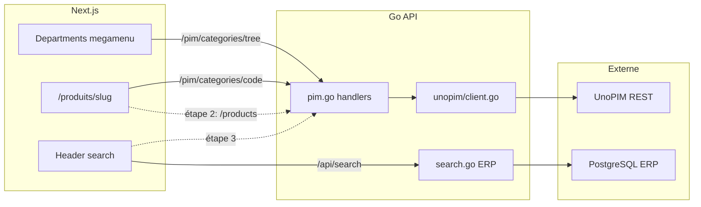

# Intégration UnoPIM — Roadmap

Document de référence pour l'intégration UnoPIM dans la plateforme Midbec.
Source de vérité produit côté PIM, gérée par Patrick.

**Dernière mise à jour :** 29 mai 2026

---

## Contexte

UnoPIM remplace progressivement les données de démo (fake-server) comme source catalogue. L'intégration suit une approche **strangler fig** : domaine par domaine, jamais tout d'un coup.

**Chaîne technique :**

```
Next.js (front) → Go API (Chi) → UnoPIM REST API (OAuth2 Laravel Passport)
```

**Principes récurrents :**

- **UI First** — fake data → validation visuelle → branchement Go API
- **Cache côté Go** — le frontend ne paie jamais le coût de la pagination UnoPIM
- **Un scope = un prompt = un commit**
- Toujours logger l'URL UnoPIM au démarrage de l'API Go

---

## Vue d'ensemble des étapes

| Étape | Scope | Statut | Date |
| --- | --- | --- | --- |
| 0 — Auth & proxy catégories brutes | Scope 10 | ✅ Done | 21–22 mai |
| 0b — Cache catégories racines | Scope 10 | ✅ Done | 25 mai |
| 0c — Catégories racines en UI | Scope 10 | ✅ Done | 26 mai |
| **1 — Arbre catégories & megamenu** | **Scope 11** | **✅ Done** | **28 mai** |
| 2 — Listing produits par catégorie | Scope 12 | 🔄 En cours | 29 mai → |
| 3 — Recherche UnoPIM + overlay prix ERP | — | ⏳ À faire | — |
| 4 — Remplacement progressif fake data | — | ⏳ À faire | — |
| Cleanup — suppression config statique | — | ⏳ À faire | — |

**Daily logs associés :** [`2026-05-21`](../03%20-%20Daily%20Logs/05%20-%20Mai%202026/2026-05-21.md) · [`2026-05-22`](../03%20-%20Daily%20Logs/05%20-%20Mai%202026/2026-05-22.md) · [`2026-05-25`](../03%20-%20Daily%20Logs/05%20-%20Mai%202026/2026-05-25.md) · [`2026-05-26`](../03%20-%20Daily%20Logs/05%20-%20Mai%202026/2026-05-26.md) · [`2026-05-28`](../03%20-%20Daily%20Logs/05%20-%20Mai%202026/2026-05-28.md)

---

## Étape 0 — Auth & connexion backend (21–22 mai)

### Réalisé

- Création du client Go : `midbec-go-api/internal/clients/unopim/client.go`
- Variables d'environnement : `PIM_BASE_URL`, `PIM_CLIENT_ID`, `PIM_CLIENT_SECRET`, `PIM_USERNAME`, `PIM_PASSWORD`
- Handler `GetPIMCategories` + route `GET /pim/categories`
- Validation Postman : `POST /oauth/token` → 200, `GET /api/v1/rest/categories` → 200 (544 catégories paginées)

### Découvertes

- Laravel Passport attend un `client_id` UUID — mettre un email provoque `invalid input syntax for type uuid`
- Codes OAuth précis : `invalid_client` → client_id/secret ; `invalid_grant` → username/password
- Les credentials OAuth sont liés à l'intégration dashboard (`Midbec_Go_API`), pas au compte admin
- Un secret régénéré invalide immédiatement tous les clients — mettre à jour `.env` et Postman en même temps

---

## Étape 0b — Cache catégories racines (25 mai)

### Réalisé

- Pagination des 55 pages côté Go (UnoPIM ne filtre pas par `parent` via query params)
- Filtre côté Go : `parent == null && code != "root"` → 19 catégories racines
- Cache mémoire 5 min TTL sur `c.mu`
- Route `GET /pim/categories/root`

### Principe

Quand une API tierce ne supporte pas le filtre dont tu as besoin, tu mets un cache côté backend — le frontend ne doit jamais payer le coût de la pagination.

---

## Étape 0c — Catégories racines en UI (26 mai)

### Réalisé

- Fix OAuth : credentials en body JSON (pas Basic Auth header)
- Fix env silencieux : `PIM_USERNAME` / `PIM_PASSWORD` (jamais `PIM_USER` / `PIM_PASS`)
- Merge `feat/unopim-integration` dans `develop`
- Mapping icônes statique dans `Departments.tsx` — 19 catégories avec PNG
- Catégories UnoPIM affichées avec icônes dans le menu de navigation

### Vigilance

- Les variables d'env manquantes échouent silencieusement en Go — log de démarrage recommandé pour les config PIM critiques

---

## Étape 1 — Arbre catégories & megamenu (28 mai) ✅

### Contexte

Patrick a finalisé le setup UnoPIM côté serveur. Objectif : débloquer le menu Catalogue en local, brancher les icônes sur les nouveaux slugs UnoPIM, rendre le megamenu dynamique depuis l'arbre UnoPIM.

### Backend Go

| Fichier | Changement |
| --- | --- |
| `internal/clients/unopim/client.go` | Fetch paginé de toutes les catégories + `buildCategoryTree` récursif |
| `internal/clients/unopim/client.go` | Cache arbre 5 min (`cachedCategoryTree`) |
| `internal/httpserver/handlers/pim.go` | Handlers arbre + détail par code |
| `internal/httpserver/router.go` | Routes `tree` et `{code}` |

**Routes ajoutées :**

```
GET /pim/categories/tree      → arbre complet (cache 5 min)
GET /pim/categories/{code}    → nœud + enfants
```

**Log au démarrage :** confirmation URL UnoPIM + alertes si credentials absents.

### Frontend

| Fichier | Rôle |
| --- | --- |
| `src/lib/api/pim.types.ts` | Types TypeScript + helpers locale (`fr_CA` / `en_US`) |
| `src/lib/api/pim.queries.ts` | Hooks TanStack Query (`usePIMCategoryTree`) |
| `src/lib/api/pim.server.ts` | Fetch server-side catégorie par code |
| `src/lib/pim/categoryIcons.ts` | Mapping slug → icône PNG (19 slugs) |
| `src/lib/pim/mapCategoryTreeToDepartments.ts` | Arbre UnoPIM → colonnes megamenu |
| `src/components/header/Departments.tsx` | Megamenu au survol piloté par l'arbre UnoPIM |
| `src/app/[locale]/produits/[slug]/page.tsx` | Page catégorie : titre localisé + grille sous-catégories |

**UI megamenu :**

- Colonnes adaptatives : 1 à 4 colonnes selon la densité de sous-catégories
- Largeur fixe colonne parentes, en-têtes semibold uppercase, hover rouge Midbec
- Icône ajoutée pour la catégorie « Divers »

### Découvertes clés

- UnoPIM prod n'écoute pas sur le même port que dev — fallback config masquait l'erreur → 502 OAuth
- Identifiants catégories passés d'IDs numériques à des **slugs** — le mapping icônes ne matchait plus
- Go sérialise les slices nil en `null` en JSON — frontend doit gérer `children ?? []`
- Fermer un terminal ne tue pas toujours le processus Go sous Windows (port bloqué)

### État actuel après étape 1

- Megamenu Catalogue : ✅ dynamique depuis UnoPIM
- Page `/produits/[slug]` : ✅ titre + sous-catégories
- Listing produits sur pages catégories : ❌ toujours fake data (`/shop/[slug]`)

---

## Étape 2 — Listing produits par catégorie 🔄 (en cours)

### Objectif

Afficher les produits UnoPIM sur `/produits/[slug]` — actuellement la page ne montre que les sous-catégories.

### API UnoPIM

Documentation : [Products API UnoPIM](https://devdocs.unopim.com/2.0/api/product.html)

```
GET /api/v1/rest/products?limit=24&page=1&filters={"categories":[{"operator":"IN","value":["slug-categorie"]}],"status":[{"operator":"=","value":true}]}
```

Filtres disponibles : `sku`, `parent`, `status`, `categories`, `family`.

### Backend Go (à faire)

- Méthode `GetProductsByCategory(ctx, code, page, limit)` dans `client.go`
- Handler `GetPIMCategoryProducts` dans `pim.go`
- Route proposée : `GET /pim/categories/{code}/products?page=&limit=`
- Pas de cache long (produits plus volatils que catégories)

### Frontend (à faire)

- Types `PIMProduct` + helpers locale (même pattern que `getCategoryName`)
- Fetch server-side dans `produits/[slug]/page.tsx`
- Grille produits (composant léger ou adaptation de `ProductCard`)
- Pagination basique (page / total / last_page)

### Hors scope étape 2

- Overlay prix ERP → reporté à l'étape 3
- Mapping SKU UnoPIM ↔ code ERP → pas encore de couche de mapping

---

## Étape 3 — Recherche UnoPIM + overlay prix ERP ⏳

### Objectif

Refactorer la recherche header (`src/hooks/useSearch.ts`) pour combiner :

- Données catalogue UnoPIM (nom, SKU, catégories)
- Prix inventaire ERP via `GET /api/search` (`midbec-go-api/internal/httpserver/handlers/search.go`)

### Contexte actuel

La recherche pièces utilise déjà l'ERP (`/api/search?q=...`). L'étape 3 unifie la source produit sur UnoPIM tout en conservant l'overlay prix ERP pour les clients connectés.

---

## Étape 4 — Remplacement progressif fake data ⏳

### Objectif

Remplacer progressivement le fake-server shop :

- `src/fake-server/endpoints/products.ts`
- `src/fake-server/database/products.ts`
- Routes `/shop` et `/shop/[slug]` (actuellement sur `shopApi` fake)

Approche strangler fig : migrer domaine par domaine, pas de big bang.

---

## Cleanup ⏳

| Item | Fichier | Raison |
| --- | --- | --- |
| Config statique départements | `src/data/headerDepartments.ts` | Remplacé par arbre UnoPIM dynamique |
| Mapping slugs UnoPIM ↔ ERP | — | Non existant — à définir avec l'équipe |

---

## Référence technique

### Routes Go actives (PIM)

```
GET /pim/categories              → proxy brut UnoPIM (paginé)
GET /pim/categories/root         → 19 catégories racines (cache 5 min)
GET /pim/categories/tree         → arbre complet (cache 5 min)
GET /pim/categories/{code}       → nœud + enfants
GET /pim/categories/{code}/products  → (étape 2, à implémenter)
```

### Variables d'environnement

```
PIM_BASE_URL=https://...
PIM_CLIENT_ID=<uuid>
PIM_CLIENT_SECRET=<secret>
PIM_USERNAME=<user intégration dashboard>
PIM_PASSWORD=<password>
```

> Ne jamais committer les valeurs — `.env.local` uniquement.

### Locale UnoPIM

| Frontend | UnoPIM |
| --- | --- |
| `fr` | `fr_CA` |
| `en` | `en_US` |

Pattern établi dans `pim.types.ts` → `getCategoryName()`.

### Architecture



### Points de vigilance permanents

- Chaque développeur doit pointer sa config locale vers le bon environnement UnoPIM (accès réseau interne requis)
- Redémarrer l'API Go après un changement backend (cache catégories actif 5 min)
- Les codes UnoPIM (slugs) ne correspondent pas aux identifiants ERP
- Vérifier channel/locale UnoPIM Midbec (`fr_CA`) vs doc générique UnoPIM (`en_AU`)
- Processus Go orphelin sous Windows peut bloquer le port — vérifier via outils système si l'API ne répond plus

---

## Comment utiliser ce document avec Cursor

1. `@unopim-roadmap.md` au début d'une session UnoPIM
2. Règle Cursor dans `midbec-front` / `midbec-go-api` : lire ce fichier avant tout travail PIM
3. Mettre à jour le tableau de statut à chaque étape complétée
