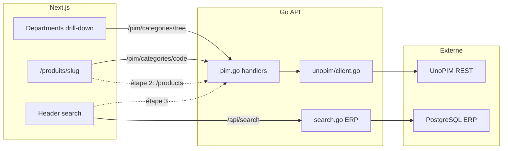

# Intégration UnoPIM — Roadmap

Document de référence pour l'intégration UnoPIM dans la plateforme Midbec.
Source de vérité produit côté PIM, gérée par Patrick.

**Dernière mise à jour :** 29 mai 2026

---

## Contexte

UnoPIM remplace progressivement les données de démo (fake-server) comme source catalogue. L'intégration suit une approche **strangler fig** : domaine par domaine, jamais tout d'un coup.

**Chaîne technique :**

```
Next.js (front) → Go API (Chi) → UnoPIM REST API (OAuth2 Laravel Passport)
```

**Principes récurrents :**

- **UI First** — fake data → validation visuelle → branchement Go API
- **Cache côté Go** — le frontend ne paie jamais le coût de la pagination UnoPIM
- **Un scope = un prompt = un commit**
- Toujours logger l'URL UnoPIM au démarrage de l'API Go

---

## Vue d'ensemble des étapes

| Étape | Scope | Statut | Date |
| --- | --- | --- | --- |
| 0 — Auth & proxy catégories brutes | Scope 10 | ✅ Done | 21–22 mai |
| 0b — Cache catégories racines | Scope 10 | ✅ Done | 25 mai |
| 0c — Catégories racines en UI | Scope 10 | ✅ Done | 26 mai |
| **1 — Arbre catégories & megamenu** | **Scope 11** | **✅ Done** | **28 mai** |
| 2 — Listing produits par catégorie | Scope 12 | ✅ Done | 29 mai |
| 2b — Navigation catalogue unifiée | Scope 12b | ✅ Done | 29 mai |
| **2c — Panneau enfant style Amazon** | **Scope 12c** | **✅ Done** | **29 mai** |
| 3 — Recherche UnoPIM (+ ERP optionnel plus tard) | — | ⏳ À faire | — |
| 4 — Remplacement progressif fake data | — | ⏳ À faire | — |
| Cleanup — suppression config statique | — | ⏳ À faire | — |

**Daily logs associés :** [`2026-05-21`](../03%20-%20Daily%20Logs/05%20-%20Mai%202026/2026-05-21.md) · [`2026-05-22`](../03%20-%20Daily%20Logs/05%20-%20Mai%202026/2026-05-22.md) · [`2026-05-25`](../03%20-%20Daily%20Logs/05%20-%20Mai%202026/2026-05-25.md) · [`2026-05-26`](../03%20-%20Daily%20Logs/05%20-%20Mai%202026/2026-05-26.md) · [`2026-05-28`](../03%20-%20Daily%20Logs/05%20-%20Mai%202026/2026-05-28.md)

---

## Étape 0 — Auth & connexion backend (21–22 mai)

### Réalisé

- Création du client Go : `midbec-go-api/internal/clients/unopim/client.go`
- Variables d'environnement : `PIM_BASE_URL`, `PIM_CLIENT_ID`, `PIM_CLIENT_SECRET`, `PIM_USERNAME`, `PIM_PASSWORD`
- Handler `GetPIMCategories` + route `GET /pim/categories`
- Validation Postman : `POST /oauth/token` → 200, `GET /api/v1/rest/categories` → 200 (544 catégories paginées)

### Découvertes

- Laravel Passport attend un `client_id` UUID — mettre un email provoque `invalid input syntax for type uuid`
- Codes OAuth précis : `invalid_client` → client_id/secret ; `invalid_grant` → username/password
- Les credentials OAuth sont liés à l'intégration dashboard (`Midbec_Go_API`), pas au compte admin
- Un secret régénéré invalide immédiatement tous les clients — mettre à jour `.env` et Postman en même temps

---

## Étape 0b — Cache catégories racines (25 mai)

### Réalisé

- Pagination des 55 pages côté Go (UnoPIM ne filtre pas par `parent` via query params)
- Filtre côté Go : `parent == null && code != "root"` → 19 catégories racines
- Cache mémoire 5 min TTL sur `c.mu`
- Route `GET /pim/categories/root`

### Principe

Quand une API tierce ne supporte pas le filtre dont tu as besoin, tu mets un cache côté backend — le frontend ne doit jamais payer le coût de la pagination.

---

## Étape 0c — Catégories racines en UI (26 mai)

### Réalisé

- Fix OAuth : credentials en body JSON (pas Basic Auth header)
- Fix env silencieux : `PIM_USERNAME` / `PIM_PASSWORD` (jamais `PIM_USER` / `PIM_PASS`)
- Merge `feat/unopim-integration` dans `develop`
- Mapping icônes statique dans `Departments.tsx` — 19 catégories avec PNG
- Catégories UnoPIM affichées avec icônes dans le menu de navigation

### Vigilance

- Les variables d'env manquantes échouent silencieusement en Go — log de démarrage recommandé pour les config PIM critiques

---

## Étape 1 — Arbre catégories & megamenu (28 mai) ✅

### Contexte

Patrick a finalisé le setup UnoPIM côté serveur. Objectif : débloquer le menu Catalogue en local, brancher les icônes sur les nouveaux slugs UnoPIM, rendre le megamenu dynamique depuis l'arbre UnoPIM.

### Backend Go

| Fichier | Changement |
| --- | --- |
| `internal/clients/unopim/client.go` | Fetch paginé de toutes les catégories + `buildCategoryTree` récursif |
| `internal/clients/unopim/client.go` | Cache arbre 5 min (`cachedCategoryTree`) |
| `internal/httpserver/handlers/pim.go` | Handlers arbre + détail par code |
| `internal/httpserver/router.go` | Routes `tree` et `{code}` |

**Routes ajoutées :**

```
GET /pim/categories/tree      → arbre complet (cache 5 min)
GET /pim/categories/{code}    → nœud + enfants
```

**Log au démarrage :** confirmation URL UnoPIM + alertes si credentials absents.

### Frontend

| Fichier | Rôle |
| --- | --- |
| `src/lib/api/pim.types.ts` | Types TypeScript + helpers locale (`fr_CA` / `en_US`) |
| `src/lib/api/pim.queries.ts` | Hooks TanStack Query (`usePIMCategoryTree`) |
| `src/lib/api/pim.server.ts` | Fetch server-side catégorie par code |
| `src/lib/pim/categoryIcons.ts` | Mapping slug → icône PNG (19 slugs) |
| `src/lib/pim/mapCategoryTreeToDepartments.ts` | Liens departments (`code`, `hasChildren`) + mobile |
| `src/components/header/Departments.tsx` | Liste parente + panneau enfant drill-down |
| `src/components/header/DepartmentsChildPanel.tsx` | Panneau enfant 360px (étape 2c) |
| `src/app/[locale]/produits/[slug]/page.tsx` | Page catégorie : titre localisé + grille sous-catégories |

**UI megamenu :**

- Colonnes adaptatives : 1 à 4 colonnes selon la densité de sous-catégories
- Largeur fixe colonne parentes, en-têtes semibold uppercase, hover rouge Midbec
- Icône ajoutée pour la catégorie « Divers »

### Découvertes clés

- UnoPIM prod n'écoute pas sur le même port que dev — fallback config masquait l'erreur → 502 OAuth
- Identifiants catégories passés d'IDs numériques à des **slugs** — le mapping icônes ne matchait plus
- Go sérialise les slices nil en `null` en JSON — frontend doit gérer `children ?? []`
- Fermer un terminal ne tue pas toujours le processus Go sous Windows (port bloqué)

### État actuel après étape 1

- Megamenu Catalogue : ✅ dynamique depuis UnoPIM
- Page `/produits/[slug]` : ✅ titre + sous-catégories
- Listing produits sur pages catégories : ❌ (corrigé à l'étape 2)

---

## Étape 2 — Listing produits par catégorie ✅ (29 mai)

### Décision produit — Option A

Une page catégorie affiche **les deux blocs** quand ils existent :

1. **Sous-catégories** — enfants directs du slug (existant)
2. **Produits** — produits UnoPIM rattachés **à ce slug uniquement** (pas récursif dans les sous-catégories)

Réversible : si l'Option A ne convient pas métier, revenir à « produits seulement sur catégories feuilles ».

### Backend Go

| Fichier | Changement |
| --- | --- |
| `internal/clients/unopim/client.go` | Types `Product`, `ProductsPage` + `GetProductsByCategory` |
| `internal/httpserver/handlers/pim.go` | Handler `GetPIMCategoryProducts` |
| `internal/httpserver/router.go` | Route `GET /pim/categories/{code}/products` (avant `{code}`) |

Filtre UnoPIM : `categories IN [code]` + `status = true`. Pas de cache. Defaults : `page=1`, `limit=24`, cap `limit=100`.

### Frontend

| Fichier | Rôle |
| --- | --- |
| `src/lib/api/pim.types.ts` | `PIMProduct`, `PIMProductsPage`, `getProductName`, `getProductImage` |
| `src/lib/api/pim.server.ts` | `fetchPIMProductsByCategory` (revalidate 60s) |
| `src/components/pim/PIMProductCard.tsx` | Carte légère (nom, SKU, image — sans prix ERP) |
| `src/app/[locale]/produits/[slug]/page.tsx` | Option A + pagination `?page=` |

### État actuel après étape 2

- Page `/produits/[slug]` : ✅ sous-catégories + grille produits + pagination
- Route `/shop/[slug]` : ❌ toujours fake data (étape 4)
- Prix ERP sur cartes produits : ❌ (étape 3)

### Validation

```bash
curl "http://localhost:8080/pim/categories/refrigeration-commerciale/products?page=1&limit=24"
```

---

## Étape 2b — Navigation catalogue unifiée ✅ (29 mai)

**Principe :** une seule structure de sous-catégories partagée (megamenu, page, mobile). **UnoPIM seul — pas de toucher à l'ERP.**

### Helper partagé

| Fichier | Rôle |
| --- | --- |
| `src/lib/pim/buildCategorySubnav.ts` | `buildCategorySubnav()` + `getPIMCategoryPath()` |

Chaque enfant direct = groupe (en-tête L2 + liens L3). Profondeur megamenu limitée à 2 niveaux.

### Megamenu desktop

| Fichier | Changement |
| --- | --- |
| `src/lib/pim/mapCategoryTreeToDepartments.ts` | 1 colonne = 1 groupe sémantique (plus de slice arithmétique) |
| `src/components/header/MegamenuLinks.tsx` | Lien « Tout voir → » stylisé par groupe |

### Page catégorie

| Fichier | Changement |
| --- | --- |
| `src/components/pim/CategorySubnavList.tsx` | Sous-catégories en liste + icônes + « Tout voir » |
| `src/app/[locale]/produits/[slug]/page.tsx` | Fil d'Ariane + compteur résultats |
| `src/lib/api/pim.server.ts` | `fetchPIMCategoryTree()` |

### Menu mobile

| Fichier | Changement |
| --- | --- |
| `src/components/mobile/MobileMenu.tsx` | Drill-down Catalogue UnoPIM (remplace stub `/catalogue`) |
| `mapPIMTreeToMobileMenuLinks()` | Arbre récursif + « Tout voir » par niveau |

### Hors scope volontaire

- Enrichissement ERP (prix, stock, panier) — reporté
- Filtres sidebar, tri in-category

### État actuel après étape 2b

- Megamenu ↔ page catégorie : **même structure** de sous-catégories (liste une colonne depuis 2c)
- Mobile : navigation catalogue UnoPIM
- Cartes produits : UnoPIM seul (nom, SKU, image)

---

## Étape 2c — Panneau enfant style Amazon ✅ (29 mai)

**Décision UX :** garder la liste parente à gauche (hover inchangé), remplacer le megamenu multi-colonnes (~1120px) par un **panneau enfant fixe 360px** avec drill-down interne (pattern conveyor mobile).

### Frontend

| Fichier | Rôle |
| --- | --- |
| `src/lib/pim/buildCategorySubnav.ts` | Export `findPIMCategoryNode()` |
| `src/lib/pim/mapCategoryTreeToDepartments.ts` | Simplifié : `code` + `hasChildren` (plus de megamenu) |
| `src/components/header/DepartmentsChildPanel.tsx` | Panneau 360px, une colonne, chevrons, « Tout voir → » |
| `src/components/header/Departments.tsx` | Liste parente conservée ; panneau enfant au survol |
| `src/components/pim/CategorySubnavList.tsx` | Liste une colonne sur page catégorie (cohérence visuelle) |
| `src/types/departments-link.ts` | `code`, `hasChildren` à la place de `submenu` |

### Hors scope (refusé)

- Drawer plein écran au clic
- Remplacement total du megamenu / liste parente

### État actuel après étape 2c

- Desktop : panneau enfant lisible (360px, drill-down)
- Page catégorie : sous-nav en liste (plus de grille multi-colonnes)
- Mobile : inchangé (drill-down déjà en place à l'étape 2b)

---

## Étape 3 — Recherche UnoPIM ⏳

### Objectif

Refactorer la recherche header (`src/hooks/useSearch.ts`) pour s'appuyer sur UnoPIM comme source catalogue.

### Note ERP

L'overlay prix ERP sur les pages catégorie est **hors scope volontaire** pour garder la stack simple. La recherche pièces peut continuer à utiliser `/api/search` (ERP) en parallèle jusqu'à décision contraire.

---

## Étape 4 — Remplacement progressif fake data ⏳

### Objectif

Remplacer progressivement le fake-server shop :

- `src/fake-server/endpoints/products.ts`
- `src/fake-server/database/products.ts`
- Routes `/shop` et `/shop/[slug]` (actuellement sur `shopApi` fake)

Approche strangler fig : migrer domaine par domaine, pas de big bang.

---

## Cleanup ⏳

| Item | Fichier | Raison |
| --- | --- | --- |
| Config statique départements | `src/data/headerDepartments.ts` | Remplacé par arbre UnoPIM dynamique |
| Mapping slugs UnoPIM ↔ ERP | — | Non existant — à définir avec l'équipe |

---

## Référence technique

### Routes Go actives (PIM)

```
GET /pim/categories              → proxy brut UnoPIM (paginé)
GET /pim/categories/root         → 19 catégories racines (cache 5 min)
GET /pim/categories/tree         → arbre complet (cache 5 min)
GET /pim/categories/{code}       → nœud + enfants
GET /pim/categories/{code}/products  → produits par catégorie (paginé, sans cache)
```

### Variables d'environnement

```
PIM_BASE_URL=https://...
PIM_CLIENT_ID=<uuid>
PIM_CLIENT_SECRET=<secret>
PIM_USERNAME=<user intégration dashboard>
PIM_PASSWORD=<password>
```

> Ne jamais committer les valeurs — `.env.local` uniquement.

### Locale UnoPIM

| Frontend | UnoPIM |
| --- | --- |
| `fr` | `fr_CA` |
| `en` | `en_US` |

Pattern établi dans `pim.types.ts` → `getCategoryName()`.

### Architecture



### Points de vigilance permanents

- Chaque développeur doit pointer sa config locale vers le bon environnement UnoPIM (accès réseau interne requis)
- Redémarrer l'API Go après un changement backend (cache catégories actif 5 min)
- Les codes UnoPIM (slugs) ne correspondent pas aux identifiants ERP
- Vérifier channel/locale UnoPIM Midbec (`fr_CA`) vs doc générique UnoPIM (`en_AU`)
- Processus Go orphelin sous Windows peut bloquer le port — vérifier via outils système si l'API ne répond plus

---

## Comment utiliser ce document avec Cursor

1. `@unopim-roadmap.md` au début d'une session UnoPIM
2. Règle Cursor dans `midbec-front` / `midbec-go-api` : lire ce fichier avant tout travail PIM
3. Mettre à jour le tableau de statut à chaque étape complétée
