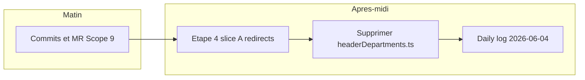

# Plan de journée — Jeudi 4 juin 2026

> Plan de travail (UnoPIM étape 4 slice A). Référence : [`unopim-roadmap.md`](../../01%20-%20Context/unopim-roadmap.md) · journal du 3 juin : [`2026-06-03.md`](./2026-06-03.md)

## Contexte

- **3 juin** : Scope 9 livré (`/recherche`, `/pim/search` paginé). Validation curl : 68 hits ERP, `results: []` (attendu sans import Patrick).
- **Blocages externes** : import catalogue Patrick ; compte PartSmart (LeadVenture). Pas de dev productif PartSmart demain.
- **Choix confirmé** : focus strict — pas de `?q=` modèle ni refonte homepage carrousels en stretch (sauf liens `/shop` cassés par les redirects, voir ci-dessous).



## Checklist

- [ ] Commits 3x (go-api, front, journey) + MR `feat/UnoPIM-*` vers develop
- [ ] `permanentRedirect` shop/page, shop/[slug], produit/[slug] + fix slides homepage
- [ ] Smoke manuel : /shop, /shop/slug PIM, /produit/sku, panier OK
- [ ] Supprimer `headerDepartments.ts` + MAJ unopim-roadmap cleanup
- [ ] Rédiger `2026-06-04.md` fin de journée

---

## Bloc 1 — Matin : hygiène livraison Scope 9 (45–60 min)

**Objectif** : figer le travail du 3 juin avant tout refactor routing.

### Vérifications

```bash
cd midbec-go-api && git status && go build ./...
cd midbec-front && git status
# smoke : curl /pim/search?q=10h&limit=6&locale=fr
# smoke : page /fr/recherche?q=10h (empty state OK)
```

### Commits recommandés (3 commits atomiques)

| # | Repo | Scope message |
|---|------|----------------|
| 1 | `midbec-go-api` | pagination + réponse enrichie `GET /pim/search` |
| 2 | `midbec-front` | page `/recherche`, `PIMSearchResultCard`, `fetchPIMSearch`, i18n, `url.partSearch` |
| 3 | `midbec-journey` | roadmap Scope 9, README, daily log 03 |

Branches : `feat/UnoPIM-api` (go-api), `feat/UnoPIM-ui` (front).

### MR / merge

- Ouvrir ou mettre à jour les MR vers `develop` avec description courte (pipeline ERP→PIM, pas de fallback).
- Merge seulement si CI verte et review OK — sinon laisser MR ouverte et continuer sur la branche feature pour l'étape 4.

**Hors scope demain** : push force, merge PartSmart, re-test catalogue avec données Patrick.

---

## Bloc 2 — Après-midi : UnoPIM étape 4 — slice A (redirects legacy)

**Objectif roadmap** : couper le trafic vers le fake shop sans toucher panier / checkout / fake-server orders.

### Stratégie redirects (Next.js `permanentRedirect` depuis App Router)

| Route legacy | Cible | Fichier |
|--------------|-------|---------|
| `/[locale]/shop` | `/[locale]/catalogue` via `url.pageCatalogue()` | `midbec-front/src/app/[locale]/shop/page.tsx` |
| `/[locale]/shop/[slug]` | `/[locale]/produits/[slug]` (même slug) | `midbec-front/src/app/[locale]/shop/[slug]/page.tsx` |
| `/[locale]/produit/[slug]` | `/[locale]/recherche?q=[slug]` | `midbec-front/src/app/[locale]/produit/[slug]/page.tsx` |

**Comportement attendu**

- Slug shop = code catégorie UnoPIM → page catégorie PIM (grille vide OK jusqu'à Patrick).
- Slug shop obsolète / inconnu → `notFound()` sur `produits/[slug]/page.tsx` (déjà en place).
- Ancien lien produit fake → recherche pièce par numéro (aligné header mode pièce).

**Implémentation type** (server component, remplacer le rendu client actuel) :

```tsx
import { permanentRedirect } from 'next/navigation';
// shop/page.tsx
permanentRedirect(url.pageCatalogue());
// shop/[slug]/page.tsx — await params
permanentRedirect(`/produits/${encodeURIComponent(slug)}`);
// produit/[slug]/page.tsx
permanentRedirect(url.partSearch(slug));
```

Utiliser `params: Promise<{ locale: string; slug?: string }>` comme sur les autres pages App Router du projet.

### Liens `/shop` à corriger (éviter CTAs cassés)

Hardcodés dans `midbec-front/src/app/[locale]/page.tsx` (hero slides) : remplacer `"/shop"` par `url.pageCatalogue()` (import `url`).

**Ne pas modifier demain** (toujours fake / panier) :

- `ShopPageShop.tsx`, `ProductCard.tsx`, cart, checkout, `shopApi`, Redux `shop` store.
- Suppression des routes `shop/` — les garder comme fichiers redirect uniquement.

### Validation manuelle slice A

1. `GET /fr/shop` → redirect vers `/fr/catalogue`
2. `GET /fr/shop/{slugPIMValide}` → `/fr/produits/{slug}` (ex. `refrigeration-commercial-1237`)
3. `GET /fr/produit/FF110HBX` → `/fr/recherche?q=FF110HBX`
4. Hero homepage → clic CTA → `/catalogue` (pas `/shop`)
5. Panier / checkout : smoke rapide — pas de régression

### Commit suggéré

`feat/ui : 'redirect legacy shop routes to catalogue PIM and part search'`

---

## Bloc 3 — Fin de journée : cleanup (20–30 min)

**Fichier mort** : `midbec-front/src/data/headerDepartments.ts` — aucun import (menu = `Departments.tsx` + arbre UnoPIM).

- Supprimer le fichier.
- `grep headerDepartments` → 0 résultat.
- Mettre à jour la section cleanup dans `unopim-roadmap.md` (note « supprimé 4 juin »).

**Commit** : `chore/ui : 'remove unused headerDepartments static config'`

---

## Bloc 4 — Clôture journée (15 min)

Créer [`2026-06-04.md`](./2026-06-04.md) selon `.cursorrules` du vault.

---

## Hors scope demain (reporté)

| Chantier | Raison |
|----------|--------|
| `?q=` sur `/recherche-par-modele` | Choix focus strict |
| Migration `useFeaturedProducts` / carrousels fake | Slice B étape 4 |
| Suppression `fake-server` products | Dépend panier / checkout |
| Overlay prix ERP sur `PIMProductCard` | Utile après import Patrick |
| PartSmart | Bloqué LeadVenture |
| Lighthouse perf | Journée dédiée ultérieure |

---

## Ordre chronologique

1. Commits + MR Scope 9 (Go → front → journey)
2. Redirects `shop` / `produit` + fix slides homepage
3. Tests manuels redirects
4. Delete `headerDepartments.ts` + doc roadmap
5. Daily log 4 juin

**Estimation** : ½ journée git/review + ½ journée redirects/cleanup/doc.

---

## Prompt Cursor (nouveau chat)

```
@unopim-roadmap.md
@2026-06-04-plan.md

Plan journée 4 juin 2026 :
1) Commits/MR Scope 9 (feat/UnoPIM-api, feat/UnoPIM-ui)
2) Etape 4 slice A : permanentRedirect /shop, /shop/[slug], /produit/[slug]
3) Homepage slides : /shop → url.pageCatalogue()
4) Supprimer headerDepartments.ts
5) Daily log 2026-06-04

Ne pas toucher panier/checkout/fake-server orders.
```
