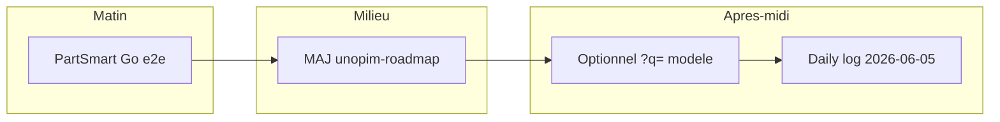

# Plan de journée — Vendredi 5 juin 2026

> Plan de travail (PartSmart e2e + doc roadmap). Référence : [`unopim-roadmap.md`](../../01%20-%20Context/unopim-roadmap.md) · journal du 4 juin : [`2026-06-04.md`](./2026-06-04.md)

## Contexte

- **4 juin** : Étape 4 slice A livrée (redirects legacy, cleanup `headerDepartments`, merge `develop`). PartSmart auth débloqué (compte Admin).
- **Blocages externes** : import produits Patrick (UnoPIM) ; catalogues PartSmart vides côté API (suivi LeadVenture).
- **Choix confirmé** : **pas de slice B** (carrousels homepage → PIM) tant que Patrick n'a pas terminé l'import produits.



## Checklist

- [ ] `.env` PartSmart + smoke `/partsmart/token`, `search/models`, `search/parts`
- [ ] Smoke UI `/recherche-par-modele` (mode modèle header)
- [ ] MAJ `unopim-roadmap.md` (étape 4 en cours, slice B bloqué Patrick, cleanup done)
- [ ] (Optionnel) `?q=` sur `/recherche-par-modele`
- [ ] Rédiger `2026-06-05.md` fin de journée

---

## Où en est la roadmap (4 juin, fin de journée)

| Zone | Statut | Détail |
|------|--------|--------|
| Auth & catégories PIM (0 → 2c) | Done | Arbre, megamenu, pages `/produits/[slug]` |
| Recherche pièces (étape 3 + Scope 9) | Done (code) | Header + `/recherche` ; `results: []` attendu sans import Patrick |
| Étape 4 slice A | Done (4 juin) | Redirects 308 shop → catalogue/PIM ; merge develop |
| Cleanup `headerDepartments` | Done (4 juin) | Fichier supprimé |
| Étape 4 slice B (carrousels) | Reporté | Import produits Patrick incomplet |
| PartSmart auth | Débloqué (4 juin) | API OK ; catalogues API en attente support |
| Overlay prix ERP | Reporté | Après import catalogue |

---

## Bloc 1 — Matin : PartSmart Go end-to-end (60–90 min)

**Objectif** : valider le client Go et les handlers avec le nouveau compte Admin.

### Prérequis `.env` Go

Mettre à jour les credentials PartSmart (compte service recréé) — ne pas committer. Voir `midbec-go-api/docs/partsmart-auth.md`. Redémarrer l'API Go après changement.

### Smoke API

1. `GET /partsmart/token` → 200 + `access_token`
2. `GET /partsmart/search/models?query=<marque>` → 200 (vide OK si catalogues non associés)
3. `GET /partsmart/search/parts?query=<ref>` → idem
4. Optionnel : `GET /partsmart/model/{catalogId}/{modelGuid}`

**Succès** : auth + proxy Go OK. `results: []` = données/support, pas bug code.

### Smoke front

- Page `recherche-par-modele` : recherche modèle via header → pas de 502
- Mode pièce header inchangé (Scope 13)

### Si catalogues vides

Documenter requête + réponse dans le daily log ; relancer ticket LeadVenture sans bloquer la validation auth.

---

## Bloc 2 — Milieu : hygiène doc & roadmap (30–45 min)

Fichier [`unopim-roadmap.md`](../../01%20-%20Context/unopim-roadmap.md) :

| Section | MAJ |
|---------|-----|
| Date + tableau vue d'ensemble | Étape 4 en cours (slice A Done, slice B bloqué Patrick) |
| Ligne Cleanup | Done (4 juin) |
| Étape 4 | Note slice B reporté |
| Vigilance | PartSmart auth OK, catalogues en attente |

---

## Bloc 3 — Après-midi : optionnel (45–60 min)

### `?q=` sur `/recherche-par-modele`

- Lire `searchParams.q`, pré-remplir recherche (pattern `recherche/page.tsx`)
- Commit : `feat/ui : 'support q query param on model search page'`
- **Ne pas faire** si PartSmart prend toute la journée

### Checklist « jour J import Patrick » (doc)

```bash
curl "http://localhost:8080/pim/categories/refrigeration-commercial-1237/products?page=1&limit=6"
curl "http://localhost:8080/pim/search?q=10h&limit=6&locale=fr"
# UI : /fr/recherche?q=10h, autocomplete header, grille /fr/produits/{slug}
```

Confirmer avec Patrick : SKU UnoPIM = `code` ERP ou `supplier_prodno` ?

---

## Bloc 4 — Clôture (15 min)

Créer [`2026-06-05.md`](./2026-06-05.md) selon `.cursorrules` du vault.

---

## Hors scope vendredi

| Chantier | Raison |
|----------|--------|
| Carrousels homepage → PIM (slice B) | Import Patrick incomplet |
| Overlay prix ERP sur cartes catalogue | Même dépendance |
| Suppression fake-server / panier | Étapes ultérieures |
| Lighthouse perf | Journée dédiée ultérieure |

---

## Ordre chronologique

1. `.env` PartSmart + redémarrage Go
2. Smoke `/partsmart/*` puis UI recherche par modèle
3. MAJ `unopim-roadmap.md`
4. (Optionnel) `?q=` recherche-par-modele
5. Daily log `2026-06-05.md`

**Estimation** : matin PartSmart + doc ; après-midi optionnel léger.

---

## Prompt Cursor (nouveau chat)

```
@unopim-roadmap.md
@2026-06-04.md
@partsmart-auth.md

Plan 5 juin 2026 :
1) Valider PartSmart Go e2e (token, search/models, search/parts) avec compte Admin
2) Smoke UI /recherche-par-modele
3) MAJ roadmap (slice A done, slice B bloque Patrick, cleanup done)
4) Optionnel : ?q= sur recherche-par-modele
5) Daily log 2026-06-05

NE PAS toucher carrousels homepage ni overlay prix PIM (import Patrick).
```
