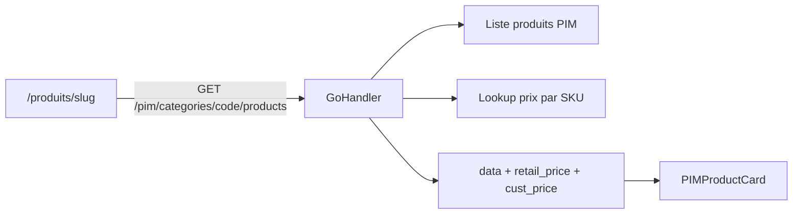
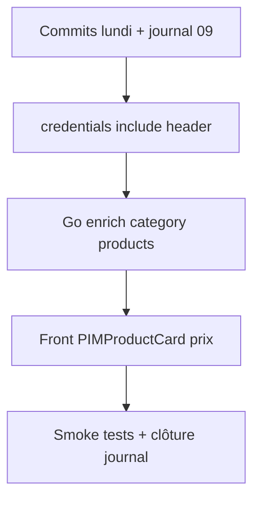

# Plan — Mardi 09 Juin 2026

> Plan de travail préparé le lundi 08 juin. À ouvrir en début de journée : `@2026-06-09-plan.md`

**Contexte :** le lundi 08 a livré le scope **UX catalogue vide** ([`2026-08-08.md`](./2026-08-08.md)). Commit encore ouvert. Patrick reste le bloquant données UnoPIM (horizon long) — pas de re-tests `/pim/search` ni Slice B.

**Principe de la journée :** clôturer le lundi, puis avancer sur le **prochain maillon catalogue** (prix ERP sur cartes) sans attendre les produits PIM.

---

## Matin — Hygiène & clôture lundi

### 1. Commits (priorité absolue)

| Repo | Scope | Fichiers clés |
| --- | --- | --- |
| `midbec-front` | UX catalogue vide | `useSearch.ts`, `SearchSuggestEmpty.tsx`, `Search.tsx`, `MobileHeader.tsx`, `recherche/page.tsx`, `produits/[slug]/page.tsx`, `public/i18n/*.json` |
| `midbec-journey` | Daily log 08 juin | [`2026-08-08.md`](./2026-08-08.md) — cocher l'objectif commit dans le journal |

**Vérifier aussi** la dette du vendredi 05 encore en working tree :

- deep-link `?q=` sur `/recherche-par-modele` (front)
- [`unopim-roadmap.md`](../../01%20-%20Context/unopim-roadmap.md) + `midbec-go-api/docs/partsmart-auth.md` (journey + api)

Si déjà commité → rien à faire. Sinon → commits séparés par repo (`un scope = un commit`).

### 2. Créer le journal du jour

Fichier : [`2026-06-09.md`](./2026-06-09.md) — même structure que les autres daily logs (objectifs cochés en fin de journée).

---

## Matin / après-midi — Dette B2B header (quick win)

**Problème** ([`2026-06-01.md`](./2026-06-01.md)) : `fetchParts` dans `midbec-front/src/hooks/useSearch.ts` n'envoie pas `credentials: 'include'` — le Go handler `SearchPIMProducts` ne reçoit donc jamais la session pour le prix client B2B.

**Fix minimal :**

```typescript
const res = await fetch(`${API_BASE}/pim/search?${params}`, {
  credentials: "include",
});
```

**Validation** (quand des SKU seront dans UnoPIM) : comparer `retail_price` vs `cust_price` connecté vs anonyme. Aujourd'hui : smoke test que l'appel ne casse rien (200 + `[]`).

**Bonus cohérence** (si le temps le permet) : `PIMSearchResultCard.tsx` affiche seulement `retail_price` — aligner sur le header (`cust_price` si session, sinon retail).

---

## Après-midi — Scope principal : overlay prix ERP sur `PIMProductCard`

Objectif backlog ([`unopim-roadmap.md`](../../01%20-%20Context/unopim-roadmap.md) étape 2) : cartes catégorie affichent nom + SKU + image **+ prix ERP**, prêtes dès que Patrick alimente une catégorie.

### Architecture cible



Aujourd'hui : `GetPIMCategoryProducts` proxy brut UnoPIM sans enrichissement. La recherche `SearchPIMProducts` fait déjà ERP → PIM ; ici c'est l'**inverse** : PIM → ERP par SKU.

### Backend Go

| Fichier | Changement |
| --- | --- |
| `midbec-go-api/internal/httpserver/handlers/pim.go` | Nouveau type enrichi : `retail_price`, `cust_price`, `is_catalog_part`, `in_stock` |
| `midbec-go-api/internal/httpserver/handlers/pim.go` | Dans `GetPIMCategoryProducts` : lookup ERP par `sku` (extraire helper `lookupERPPriceBySKU` si duplication avec `search.go`) |
| `midbec-go-api/internal/httpserver/handlers/pim.go` | Session B2B : même pattern `reqctx.GetWebUserID` + `clientCode` que `SearchPIMProducts` |

Pas de cache volontaire (aligné roadmap étape 2).

### Frontend

| Fichier | Changement |
| --- | --- |
| `midbec-front/src/lib/api/pim.types.ts` | Étendre `PIMProduct` ou créer `PIMProductWithPrice` pour la réponse catégorie |
| `midbec-front/src/components/pim/PIMProductCard.tsx` | Afficher prix (badge stock/catalogue optionnel, cohérent avec `PIMSearchResultCard`) |
| `midbec-front/src/app/[locale]/produits/[slug]/page.tsx` | Aucun changement structurel si le type enrichi remplace `PIMProduct` |

### Validation sans données Patrick

```bash
curl "http://localhost:8080/pim/categories/refrigeration-commercial-1237/products?page=1&limit=6"
# Attendu : total 0, pas de régression 502
# Quand Patrick ajoute des produits : champs prix présents dans JSON
```

---

## Parallèle léger (non bloquant)

- **Checkpoint Patrick** (mail/Slack) : ETA import + SKU UnoPIM = `code` ERP ou `supplier_prodno` ?
- **Brian / LeadVenture** : confirmer `groupCode` si besoin (vigilance 5 juin) — seulement si du temps

---

## Hors scope mardi (gelé)

| Item | Raison |
| --- | --- |
| Slice B carrousels homepage → PIM | `total: 0` partout |
| Re-tests checklist `/pim/search` | Aucune valeur tant que SKU absents |
| PDP SKU UnoPIM | Post-import |
| Fallback ERP sans PIM | Décision produit du 1er juin |

---

## Objectifs du jour (checklist journal)

- [ ] Commits front UX (lundi) + journal journey
- [ ] Vérifier / clôturer dette commits 5 juin
- [ ] `credentials: 'include'` sur autocomplete pièces header
- [ ] Go : enrichir `GET /pim/categories/{code}/products` avec prix ERP
- [ ] Front : `PIMProductCard` affiche prix (+ badge stock si pertinent)
- [ ] Smoke curl catégorie — pas de régression
- [ ] Compléter [`2026-06-09.md`](./2026-06-09.md)

---

## Séquence horaire suggérée



**Critère de succès :** fin de journée = lundi clôturé en git, header B2B-ready, pipeline prix catégorie codé de bout en bout — activable dès le premier produit visible dans UnoPIM.
