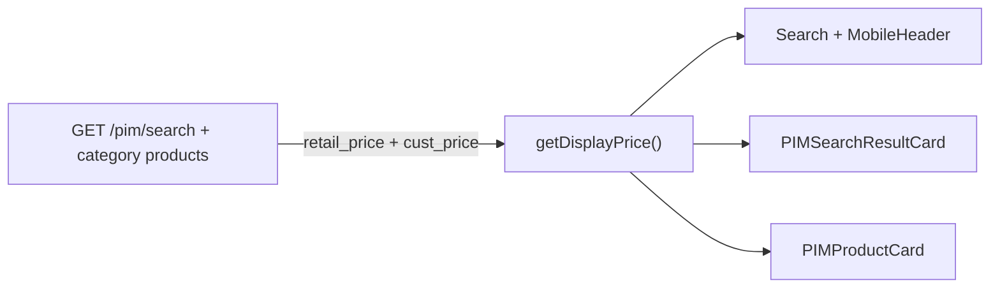
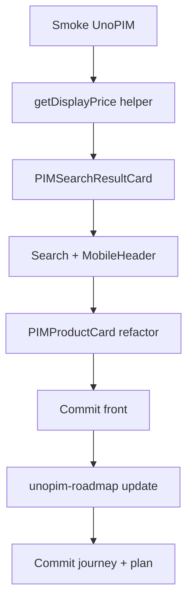

# Plan — Mercredi 10 Juin 2026

> Plan de travail. Journal : [`2026-06-10.md`](./2026-06-10.md)

**Contexte :** le mardi 09 a livré le pipeline **prix ERP sur cartes catégorie** ([`2026-06-09.md`](./2026-06-09.md)). PartSmart clos. Patrick reste le bloquant données UnoPIM (OAuth 500 sur `10.10.10.6:8000`) — pas de re-tests end-to-end catalogue tant que l'env n'est pas stable.

**Principe de la journée :** fermer la dette d'affichage prix B2B sur les surfaces restantes (header + page `/recherche`), centraliser la logique dans un helper, puis synchroniser [`unopim-roadmap.md`](../../01%20-%20Context/unopim-roadmap.md).

---

## Matin — Health check UnoPIM (5 min, non bloquant)

Smoke rapide pour savoir si Patrick a débloqué l'env :

```bash
curl.exe "http://localhost:8080/pim/categories/tree"
curl.exe "http://localhost:8080/pim/categories/refrigeration-commercial-1237/products?page=1&limit=6"
```

| Résultat | Action |
| --- | --- |
| 502 OAuth 500 | Continuer le scope code (pas de validation données) |
| HTTP 200 | Bonus : vérifier champs `retail_price` / `cust_price` dans le JSON ; noter dans le journal |

---

## Matin / après-midi — Scope principal : cohérence prix B2B

### Problème

`PIMProductCard` (livré le 09) applique déjà la logique B2B :

```typescript
const displayPrice =
    product.cust_price > 0 && product.cust_price !== product.retail_price
        ? product.cust_price
        : product.retail_price;
```

Les trois autres surfaces n'affichent que `retail_price` :

| Fichier | Ligne |
| --- | --- |
| `midbec-front/src/components/pim/PIMSearchResultCard.tsx` | ~50 |
| `midbec-front/src/components/header/Search.tsx` | ~231 |
| `midbec-front/src/components/mobile/MobileHeader.tsx` | ~221 |

Le backend envoie déjà `cust_price` dans `PIMSearchSuggestion` — le fix est **frontend uniquement**. Session B2B déjà câblée le 09 via `credentials: 'include'` sur `/pim/search`.

### Solution — helper partagé

| Fichier | Changement |
| --- | --- |
| `midbec-front/src/lib/api/pim.types.ts` | Ajouter `getDisplayPrice(retail_price, cust_price): number` — même règle que `PIMProductCard` |
| `PIMProductCard.tsx` | Remplacer logique inline par le helper |
| `PIMSearchResultCard.tsx` | Utiliser `getDisplayPrice` ; masquer prix si `<= 0` (aligné carte catégorie) |
| `Search.tsx` | Idem suggestions mode pièce |
| `MobileHeader.tsx` | Idem mobile |

### Architecture cible



Pas de changement Go.

### Validation sans données Patrick

- Lint / build front : pas de régression
- Smoke visuel : autocomplete header mode pièce → pas de crash (résultats vides OK)
- Smoke page `/recherche` : cartes sans erreur si `results: []`
- **Quand données disponibles** : comparer prix connecté B2B vs anonyme sur header + `/recherche` + grille catégorie

### Commit front

Un scope = un commit :

```
feat/frontend : 'unify B2B display price across PIM surfaces'
```

---

## Après-midi — Mise à jour roadmap UnoPIM

Fichier : [`unopim-roadmap.md`](../../01%20-%20Context/unopim-roadmap.md)

| Section | Mise à jour |
| --- | --- |
| Tableau vue d'ensemble | Nouvelle ligne **2d — Overlay prix ERP cartes catégorie** : Done (9 juin) |
| Étape 2 — État actuel | Remplacer « Prix ERP sur cartes : hors scope volontaire » par Done + lien journal 09 |
| Étape 3 — Hors scope | Retirer « overlay prix ERP sur cartes pages catégorie (étape 2) » |
| Dernière mise à jour | 10 juin 2026 |
| Daily logs associés | Ajouter lien [`2026-06-09.md`](./2026-06-09.md) |

Commit journey (roadmap + plan) :

```
docs/journey : 'mark category card ERP pricing done in unopim roadmap'
```

Puis commit plan selon [`.cursorrules`](../../.cursorrules) :

```
Ajout de la note du 10 juin 2026
```

---

## Parallèle léger (non bloquant)

- **Checkpoint Patrick** (mail/Slack) : ETA stabilisation OAuth + confirmation SKU UnoPIM = `code` ERP ou `supplier_prodno` ?

---

## Hors scope mercredi (gelé)

| Item | Raison |
| --- | --- |
| Slice B carrousels homepage → PIM | `total: 0` partout |
| Checklist complète « jour J import Patrick » | Nécessite SKU alignés |
| PDP SKU UnoPIM | Post-import |
| Fallback ERP sans PIM | Décision produit du 1er juin |
| PartSmart | Clos le 09 |

---

## Objectifs du jour (checklist journal)

- [ ] Smoke health check UnoPIM (502 vs 200)
- [ ] Helper `getDisplayPrice` dans `pim.types.ts`
- [ ] `PIMSearchResultCard` — prix B2B cohérent
- [ ] `Search.tsx` + `MobileHeader.tsx` — prix B2B cohérent
- [ ] Refactor `PIMProductCard` sur le helper
- [ ] Commit front
- [ ] Mise à jour `unopim-roadmap.md` (étape 2d done)
- [ ] Commit journey (roadmap + plan 10)
- [ ] Compléter [`2026-06-10.md`](./2026-06-10.md)

---

## Séquence horaire suggérée



**Critère de succès :** une seule règle d'affichage prix B2B sur header, `/recherche` et grilles catégorie ; roadmap à jour ; plan 10 commité et pushé.

---

## Git — commandes (après implémentation)

Dans `midbec-front` :

```bash
git add .
git commit -m "feat/frontend : 'unify B2B display price across PIM surfaces'"
git push
```

Dans `midbec-journey` :

```bash
git add .
git commit -m "docs/journey : 'mark category card ERP pricing done in unopim roadmap'"
git push
git add .
git commit -m "Ajout de la note du 10 juin 2026"
git push
```

(Deux commits journey si roadmap et plan sont faits séparément — ou un seul commit si tout est staged ensemble.)
