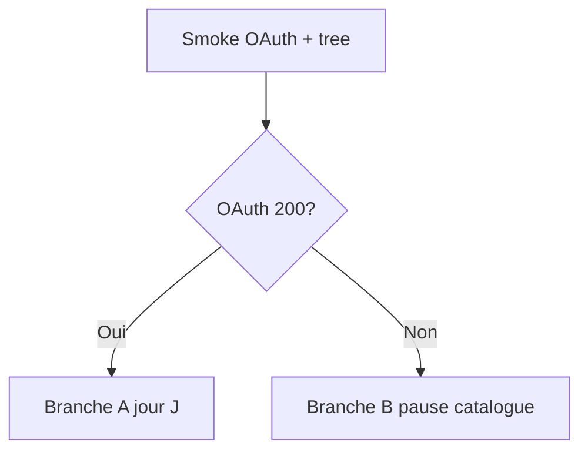
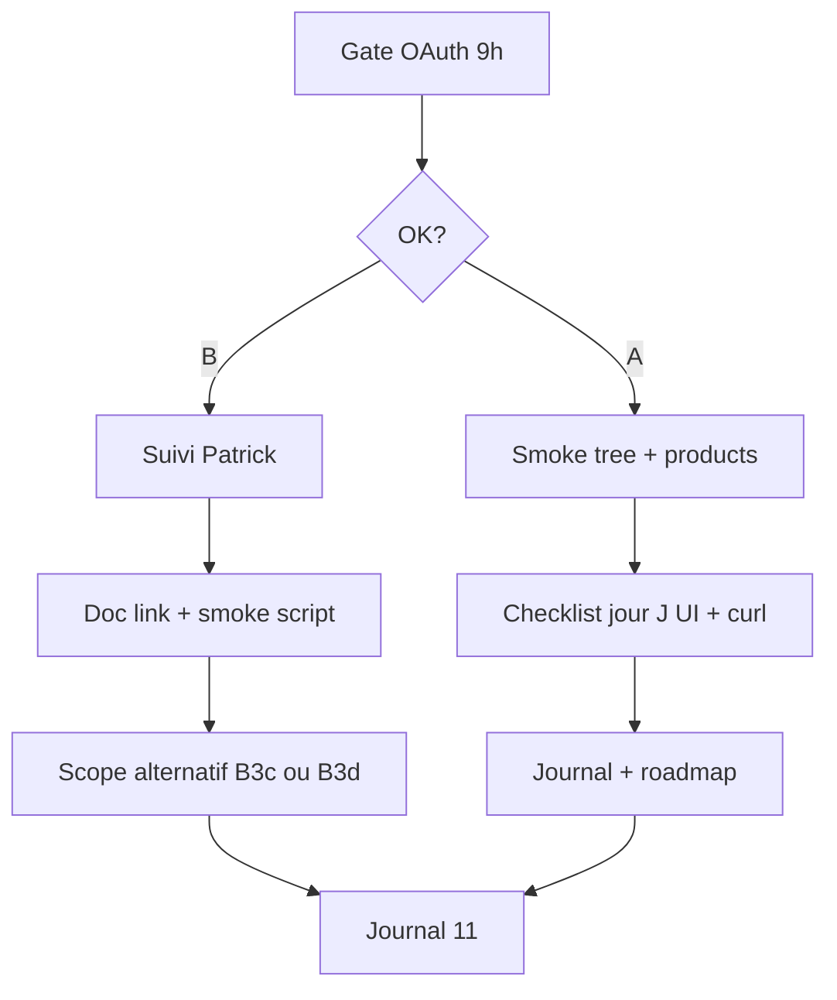

# Plan — Jeudi 11 Juin 2026

> Plan de travail. Journal : [`2026-06-11.md`](./2026-06-11.md)

**Contexte :** le mercredi 10 a livré la cohérence prix B2B ([`2026-06-10.md`](./2026-06-10.md)) et isolé le blocage catalogue — OAuth UnoPIM FatalError (Passport / AdminApi), ERP OK mais `results: []` sur `/pim/search`. Doc back `midbec-go-api/docs/unopim-catalogue.md` ajoutée. Rencontre Patrick : comprendre UnoPIM pour l'aider (OAuth + import).

**Principe de la journée :** **gate OAuth** le matin → branche A (validation jour J) si débloqué, branche B (pause catalogue + scope site alternatif) sinon.

---

## Matin — Gate OAuth (15 min, obligatoire)

Décision avant tout autre travail :

```bash
curl.exe "http://localhost:8080/pim/categories/tree"
curl.exe "http://localhost:8080/pim/search?q=80040&limit=6&locale=fr"
# Si tree 502 : tester OAuth direct sur instance dev (credentials .env, ne pas logger)
```

| Résultat gate | Branche |
| --- | --- |
| `/pim/categories/tree` → HTTP 200 + JSON | **Branche A** |
| 502 + log `oauth token returned status 500/429` | **Branche B** |
| 200 tree mais `results: []` sur search | **Branche A partielle** (OAuth OK, données manquantes) |



Noter le résultat dans le journal — sans IP interne ni secrets (cf. [`.cursorrules`](../../.cursorrules)).

---

## Branche A — OAuth débloqué (avec ou sans produits)

### A1 — Validation OAuth + arbre

- Smoke `GET /pim/categories/tree` → arbre JSON
- Smoke `GET /pim/categories/refrigeration-commercial-1237` → nœud + enfants
- Redémarrer Go si besoin (cache catégories 5 min)

### A2 — Checklist « jour J import Patrick »

Référence : [`unopim-roadmap.md`](../../01%20-%20Context/unopim-roadmap.md) + `midbec-go-api/docs/unopim-catalogue.md` (section 5 — règles SKU, catégorie, locales).

| # | Test | Attendu |
| --- | --- | --- |
| 1 | `curl .../pim/categories/{code}/products?page=1&limit=6` | HTTP 200 ; si import : `total > 0` + `retail_price`, `cust_price` |
| 2 | `curl .../pim/search?q=<sku_erp>&limit=6` | `results` non vide si SKU aligné ERP ↔ UnoPIM |
| 3 | UI header mode Pièce — autocomplete | Suggestions + prix (`getDisplayPrice`) |
| 4 | UI `/fr/recherche?q=<sku>` | Cartes avec prix |
| 5 | UI `/fr/produits/{slug}` | Grille produits si catégorie alimentée |
| 6 | Session B2B vs anonyme (header) | `cust_price` ≠ `retail_price` si client B2B |

**Décision avec Patrick :** SKU UnoPIM = `code` ERP ou `supplier_prodno` ?

### A3 — Documentation

- Mettre à jour [`unopim-roadmap.md`](../../01%20-%20Context/unopim-roadmap.md) : statut validation données, lien vers doc back
- Journal 11 : cocher checklist, noter premier SKU test validé

### Commits (si changements)

- Journey si roadmap / journal / plan
- Code front/back **seulement si** fix technique ressort de la validation

---

## Branche B — OAuth toujours down

### B1 — Suivi Patrick (30 min max)

- Relancer : FatalError Passport / AdminApi sur `/oauth/token` (sans détail sensible dans le journal)
- Partager `midbec-go-api/docs/unopim-catalogue.md` section 4 (ordre de configuration)
- Obtenir ETA fix OAuth + premier lot SKU test

### B2 — Pause catalogue Midbec

Ne pas coder PDP, Slice B, ni fallback ERP sans PIM — gel maintenu ([`2026-06-10.md`](./2026-06-10.md)).

### B3 — Scope site alternatif (choisir **un** item)

| Option | Repo | Effort | Valeur sans PIM |
| --- | --- | --- | --- |
| **B3a — Checklist smoke scriptée** | `midbec-go-api` ou journey | ~1h | Jour J en 5 min |
| **B3b — Lien doc journey ↔ back** | `midbec-journey` | ~30 min | roadmap → `docs/unopim-catalogue.md` |
| **B3c — PartSmart panier prix ERP** | `midbec-front` | ~½ j | IPL add-to-cart `price: 0` aujourd'hui |
| **B3d — Forward session B2B SSR** | `midbec-front` | ~½ j | `/recherche` + grilles sans cookies session |

**Recommandation :** B3a + B3b le matin ; B3c ou B3d l'après-midi — un scope, un commit.

---

## Parallèle léger (les deux branches)

- Ne pas spammer curl OAuth (429 en plus du 500)
- PartSmart : voie pièces utile (`/recherche-par-modele`)

---

## Hors scope jeudi (gelé)

| Item | Raison |
| --- | --- |
| Slice B carrousels homepage | `total: 0` ou OAuth down |
| PDP SKU | Gelé sans données (sauf branche A avec `total > 0`) |
| Fallback ERP sans PIM | Décision produit reportée |
| Big bang import Patrick | Rôle Patrick — Ryan = support + smoke |

---

## Objectifs du jour (checklist journal)

- [ ] Gate OAuth exécutée + branche A ou B notée
- [ ] **Branche A** : checklist jour J (partielle ou complète)
- [ ] **Branche A** : décision SKU ERP documentée avec Patrick
- [ ] **Branche B** : suivi Patrick + doc partagée
- [ ] **Branche B** : un scope alternatif livré (B3a–d)
- [ ] Mise à jour roadmap si statut changé
- [ ] Compléter [`2026-06-11.md`](./2026-06-11.md)

---

## Séquence horaire suggérée



**Critère de succès Branche A :** OAuth 200 + au moins un SKU visible end-to-end (curl ou UI).

**Critère de succès Branche B :** gate documentée, Patrick relancé avec doc, un livrable hors PIM commité + journal à jour.

---

## Git (après implémentation)

Journey (typique) :

```bash
cd midbec-journey
git add .
git commit -m "Ajout de la note du 11 juin 2026"
git push
```

Branche B — scope alternatif back (ex. smoke script) :

```bash
cd midbec-go-api
git add .
git commit -m "chore/api : 'add PIM smoke checklist script'"
git push
```
