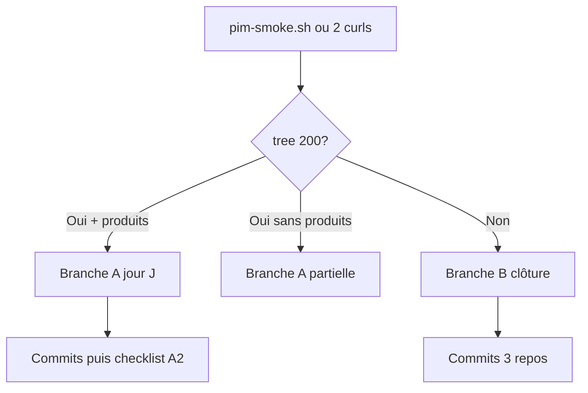
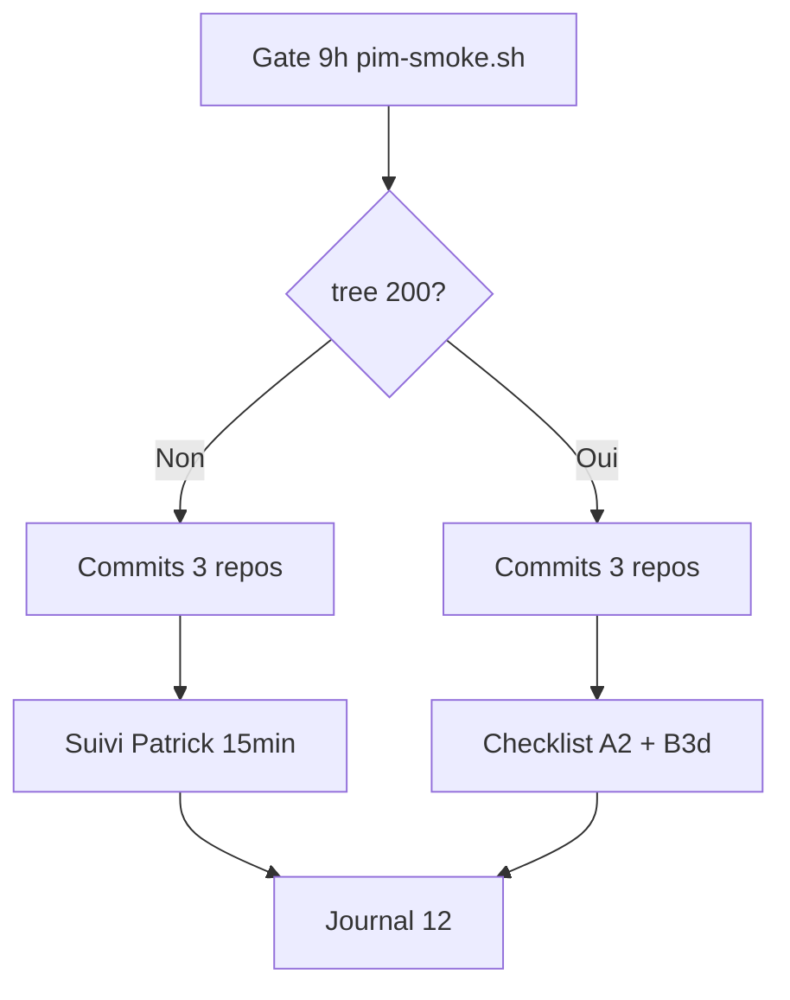

# Plan — Vendredi 12 juin 2026

> Plan de travail. Journal : [`2026-06-12.md`](./2026-06-12.md)

**Contexte :** le jeudi 11 a confirmé **Branche B** live ([`2026-06-11.md`](./2026-06-11.md)) — OAuth UnoPIM FatalError Passport, `tree` 502, `search` ERP 30 / `results: []`. Livrables code/docs du 11 **non commités** dans les 3 repos. B3c (PartSmart panier prix ERP) reporté.

**Principe de la journée :** **gate OAuth** → **commits clôture 11** → **Branche A** si débloqué, sinon **Branche B légère** (pas de nouveau scope code).

**Priorité confirmée :** clôture git uniquement — pas de B3c ni autre feature l'après-midi.

---

## Matin — Gate OAuth (10 min, obligatoire)

Utiliser le script livré hier plutôt que des curls manuels :

```bash
cd midbec-go-api
go run ./cmd/main.go
# autre terminal :
./scripts/pim-smoke.sh
```

Alternative manuelle (2 curls max) :

```bash
curl.exe "http://localhost:8080/pim/categories/tree"
curl.exe "http://localhost:8080/pim/search?q=80040&limit=6&locale=fr"
```

| Résultat gate | Branche |
| --- | --- |
| tree → HTTP 200 + JSON | **Branche A** |
| tree → 502 ou script `B` | **Branche B** |
| tree 200 + `results: []` | **Branche A partielle** |



Noter le résultat dans le journal — sans IP interne ni secrets (cf. [`.cursorrules`](../../.cursorrules)).

---

## Matinée — Commits clôture 11 juin (priorité)

Fichiers à inclure par repo :

### `midbec-go-api`
- `scripts/pim-smoke.sh` (nouveau)
- `docs/unopim-catalogue.md` (section 8 + liens)

### `midbec-front`
- `src/lib/api/pim.server.ts` — `pimServerFetchInit()`, forward `mb_session` (B3d)

### `midbec-journey`
- [`2026-06-11.md`](./2026-06-11.md)
- [`unopim-roadmap.md`](../../01%20-%20Context/unopim-roadmap.md)
- [`2026-06-12-plan.md`](./2026-06-12-plan.md) (ce plan)

**Ordre suggéré :** go-api → front → journey (journey référence les deux autres).

**Vérification avant push :** `git status` propre dans chaque repo ; pas de `.env` ni secrets.

---

## Branche A — OAuth débloqué (si tree → 200)

### Checklist « jour J import Patrick »

Références : [`unopim-roadmap.md`](../../01%20-%20Context/unopim-roadmap.md) + `midbec-go-api/docs/unopim-catalogue.md` (section 5 — règles SKU, catégorie, locales).

| # | Test | Attendu |
| --- | --- | --- |
| 1 | `curl .../pim/categories/{code}/products?page=1&limit=6` | HTTP 200 ; si import : `total > 0` + prix ERP |
| 2 | `curl .../pim/search?q=<sku_erp>&limit=6` | `results` non vide si SKU aligné |
| 3 | UI header mode Pièce — autocomplete | suggestions + `getDisplayPrice` |
| 4 | UI `/fr/recherche?q=<sku>` | cartes avec prix |
| 5 | UI `/fr/produits/{slug}` | grille si catégorie alimentée |
| 6 | Session B2B vs anonyme | `cust_price` ≠ `retail_price` si B2B |
| 7 | **B3d SSR** | même prix B2B sur `/recherche` et grilles qu'en header |

**Décision avec Patrick :** SKU UnoPIM = `code` ERP ou `supplier_prodno` ?

**Critère de succès Branche A :** OAuth 200 + au moins un SKU visible end-to-end + commits 11 poussés.

---

## Branche B — OAuth toujours down (scénario probable)

### B1 — Suivi Patrick (15 min max)
- Statut fix Passport — réponse reçue ou relance courte
- Rappeler doc : `midbec-go-api/docs/unopim-catalogue.md` section 4

### B2 — Pause catalogue
Gel maintenu — pas de PDP, Slice B, fallback ERP, B3c.

### B3 — Après-midi : clôture uniquement
- Commits 3 repos (si pas fini le matin)
- Compléter journal [`2026-06-12.md`](./2026-06-12.md)
- Roadmap : mettre à jour statut infra **seulement si** gate différente du 11

**Pas de nouveau scope code** (B3c PartSmart reporté à une journée ultérieure).

**Critère de succès Branche B :** gate documentée + 3 repos commités/poussés + journal 12 à jour.

---

## Parallèle léger

- PartSmart : `/fr/recherche-par-modele` — smoke rapide si besoin de valider autre chose que le PIM
- Ne pas spammer OAuth

---

## Hors scope vendredi (gelé)

| Item | Raison |
| --- | --- |
| B3c PartSmart panier prix ERP | Reporté — clôture git prioritaire |
| Slice B carrousels homepage | OAuth / `total: 0` |
| PDP SKU | Gelé sans données |
| Fallback ERP sans PIM | Décision produit reportée |
| Big bang import Patrick | Rôle Patrick |

---

## Objectifs du jour (checklist journal)

- [ ] Gate OAuth (`pim-smoke.sh`) + branche notée
- [ ] Commit + push `midbec-go-api` (script + doc)
- [ ] Commit + push `midbec-front` (pim.server.ts)
- [ ] Commit + push `midbec-journey` (journal 11 + plan 12 + roadmap si changé)
- [ ] **Branche A** : checklist jour J + validation B3d SSR
- [ ] **Branche B** : suivi Patrick + journal 12 complété
- [ ] Compléter [`2026-06-12.md`](./2026-06-12.md)

---

## Séquence horaire suggérée



---

## Git (messages suggérés)

```bash
# midbec-go-api
git commit -m "chore/api : 'add PIM smoke script and catalogue doc links'"

# midbec-front
git commit -m "feat/frontend : 'forward B2B session cookie in PIM SSR fetches'"

# midbec-journey
git commit -m "docs/journey : 'journal 11 juin and plan 12 juin'"
```
