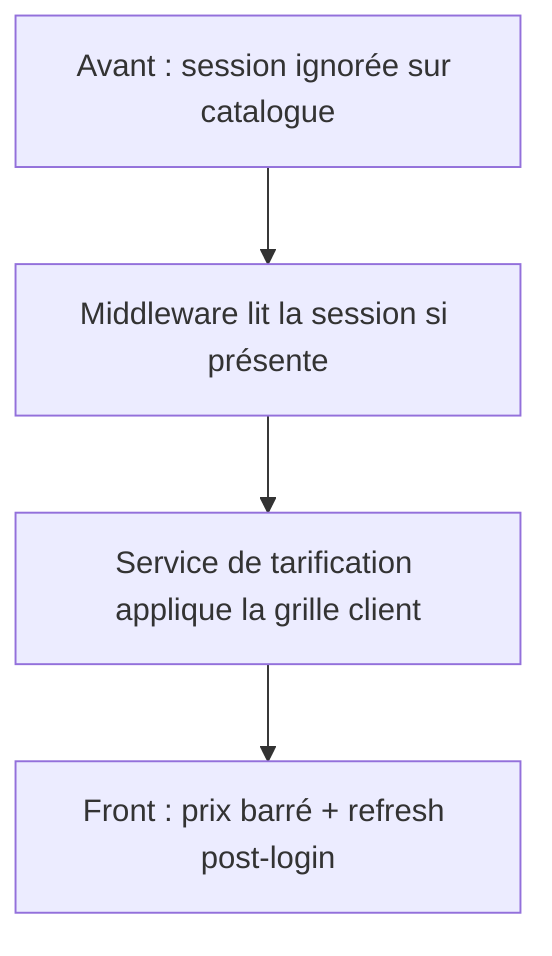

# 📅 Vendredi 3 Juillet 2026 — Tarification différenciée par client

## 🧠 Humeur & contexte

Suite directe de la veille. Patrick a confirmé la règle métier : chaque client peut avoir son propre prix sur un produit donné. Exemple concret : un produit coûte un prix public au détail, mais un prix négocié plus bas pour un compte spécifique.

Le code pour faire ça existait déjà dans le nouveau système — en théorie. En pratique, personne ne voyait le prix client s'afficher.

---

## 🎯 Objectifs du jour

- [x] Implémentation code (backend + front + tests unitaires)
- [x] Serveurs lancés et smoke test navigateur (session lue correctement)
- [ ] Validation complète — **lundi** (login compte test à investiguer + prix produit de référence)

---

## En bref — ce qu'on a fait

### Le vrai problème

Quand un client se connectait, le site envoyait bien son cookie de session à l'API. Mais l'API **ignorait** ce cookie sur les pages catalogue publiques : recherche, fiche produit, listes par catégorie. Ces routes ne lisaient jamais la session — donc tout le monde recevait le prix public, connecté ou non.

Le moteur de prix client était installé ; la clé n'était simplement pas tournée sur ces routes.

### La correction backend

On a ajouté un middleware d'authentification optionnelle : il lit la session **si** l'utilisateur est connecté, sans bloquer les visiteurs anonymes. On l'a branché sur les routes qui renvoient des prix.

Dès qu'une session valide est détectée, l'API récupère l'identifiant client, cherche sa grille de prix, et renvoie le prix négocié en plus du prix public. Aucun changement dans la logique métier existante — on a branché le fil manquant.

### La correction frontend

Trois ajustements pour que l'expérience suive la connexion :

1. **Cache** — les listes de produits par catégorie ne sont plus mises en cache quand une session est active (évite d'afficher un prix public figé après connexion).
2. **Rafraîchissement post-login** — après connexion, la page se recharge pour afficher les bons prix sans rechargement manuel.
3. **Panier** — si des articles ont été ajoutés en anonyme, leurs prix sont recalculés après connexion.
4. **Cartes listing** — le prix public apparaît barré quand le client a une remise négociée (comme sur la fiche produit, déjà en place).

### Ce qui marchait déjà

La fiche produit détaillée, les helpers de calcul de prix, le transfert de session côté frontend, et toute la logique métier de tarification côté backend — rien à réécrire, juste à activer.

---

## Incident infra

Le backend ne démarrait pas : le port était déjà occupé.

- Une **ancienne instance** du service tournait encore en arrière-plan.
- Un service Windows tiers occupait aussi ce port.

Résolu manuellement (arrêt du service en admin + kill de l'ancienne instance).

**🟡 Réflexe confirmé, pas encore senior** : le diagnostic était bon (deux coupables identifiés au lieu de redémarrer en boucle), mais la résolution reste une discipline mentale plutôt qu'un garde-fou. Un réflexe senior transforme l'incident en vérification automatique — un script de démarrage qui détecte le port occupé et alerte/kill avant de relancer, ou au minimum la commande de diagnostic documentée dans les règles du projet. À trancher : ce garde-fou a-t-il été ajouté, ou est-ce resté une note mentale ?

---

## Ce qu'on a validé aujourd'hui

- Backend et frontend démarrés correctement une fois le port libéré.
- Connecté avec un compte de test dans le navigateur : les logs API montrent bien la lecture de session sur les routes prix.
- Requête sans cookie de session → prix client = prix public — comportement correct pour un visiteur anonyme.
- Le compte de test utilisé **n'est pas** le compte de test de Patrick — pas de prix négocié attendu avec ce compte.

**🟢 Réflexe senior** : ne pas avoir forcé une validation partielle avec le mauvais compte pour cocher la case du jour. La tentation confirmée aurait été de dire _"le comportement anonyme est correct, donc c'est validé"_ et fermer la tâche. Le réflexe senior a été d'isoler la variable non contrôlée (le bon compte n'est pas encore confirmé compatible avec le nouveau système) et de refuser de conclure sur une donnée invalide plutôt que sur un résultat propre mais non concluant.

---

## Ce qui reste pour lundi

- **Investiguer le login** : credentials du compte test que Patrick utilise sur l'ancien système — compatibilité avec le nouveau système à confirmer. Première étape lundi : tenter la connexion et noter le résultat.
- **Définir le critère d'arrêt avant de tenter** : à quel signal on bascule de _"je réessaie avec une variante"_ vers _"le login ne passe pas, j'investigue le système"_ ? À formuler explicitement avant de commencer — pas après plusieurs tentatives.
- Si le login passe : valider le produit de référence sur tous les parcours (fiche, recherche, grille, panier).
- Si le login échoue : comprendre pourquoi avant de valider les prix.
- Compléter la checklist de validation UI (6 parcours).

---

## Points de vigilance

- Credentials du compte test : valides sur l'ancien système ; pas encore testés sur le nouveau — investigation lundi en premier
- Compte sans grille de prix négociée → le prix client reste égal au prix public malgré l'authentification
- Cache cross-utilisateur mitigé par la désactivation du cache quand une session est active
- Panier ajouté en anonyme : recalcul des prix déclenché après connexion
- Garde-fou pour le conflit de port : à ajouter — pas encore fait

---

## ⏭️ Next steps

- Lundi : investiguer login compte test **avec critère d'arrêt défini avant de commencer**, puis validation complète
- Checkout : brancher l'action finale du panier (backlog ouvert)
- Dès la dépendance externe résolue : re-valider la recherche produit et les catégories
