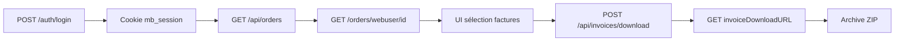

# 📅 Plan — Vendredi 17 Juillet 2026

## 🧠 Contexte (reprise du 16)

- **ERP prod validé Postman** : `accounts/code/000913` → `orders/customer` → `invoiceDownloadURL` → PDF OK (ex. facture `01F1049150`)
- **Code Midbec prêt** sur `develop` :
  - [`invoices.go`](../../../midbec-go-api/internal/httpserver/handlers/invoices.go)
  - [`AccountPageInvoices.tsx`](../../../midbec-front/src/features/account/AccountPageInvoices.tsx)
- **Blocage UI** : pas de webuser prod utilisable — comptes sandbox (`1020`/`TEST`) inopérants en prod ; Whirlpool `000913` a des factures mais **aucun webuser portail** (`returncode=5`)
- **UnoPim** : OAuth bloqué (permissions clés serveur) — fix Patrick en attente

**Objectif du jour :** fermer la boucle **UI factures** avec un compte prod. UnoPim en second.

---

## 🎯 Priorité 1 — Factures UI

- [x] Demander à **Patrick** un webuser prod — **envoyé, en attente**
- [ ] Réception credentials Patrick (email + mdp temporaire)
- [ ] Basculer `.env` : `ERP_BASE_URL=http://10.10.10.201:8088/production` (actuellement `/test`)
- [ ] Probe : `go run ./scripts/test-login.go <email> <mdp>`
- [ ] Probe : `go run ./scripts/probe-invoices.go <email> <mdp>`
- [ ] Test E2E : login → `/compte/factures` → sélection → download ZIP
- [ ] Si OK : feature factures validée côté intégration

**Message Patrick (envoyé) :**

> Il me faut un **webuser** (email + mot de passe) dont `GET /orders/webuser` renvoie des lignes avec `invoiceDownloadURL`. Whirlpool `000913` a des factures via `orders/customer` mais **aucun webuser portail** détecté (`returncode=5`).

**Séquence dès réception credentials :**

```bash
# 1. midbec-go-api/.env → ERP_BASE_URL=.../production
# 2. Probes
go run ./scripts/test-login.go <email> <mdp>
go run ./scripts/probe-invoices.go <email> <mdp>
# 3. E2E manuel : login → /compte/factures → sélection → download ZIP
```

---

## 🎯 Priorité 2 — UnoPim (si Patrick a fixé OAuth)

- [ ] `go run ./scripts/pim-oauth-probe.go ./scripts/probeenv.go`
- [ ] `./scripts/pim-smoke.sh http://localhost:8080 80040`
- [ ] Basculer `NEXT_PUBLIC_CATALOG_SOURCE=pim` + QA catalogue

---

## 🎯 Priorité 3 — Hygiène

- [ ] Remettre `.env` sur `/test` pour dev courant (après validation factures)
- [ ] Compléter ce fichier en rétro fin de journée

---

## Optionnel

- [ ] `git pull` sur les 3 repos (`midbec-go-api`, `midbec-front`, `midbec-journey`)
- [ ] Demander à Patrick sync factures `/test` pour `001020` (nice-to-have)

---

## 🛠️ Commandes utiles

```bash
# Probes factures (prod, read-only)
go run ./scripts/test-login.go <email> <mdp>
go run ./scripts/probe-invoices.go <email> <mdp>

# Postman (déjà validé — référence)
GET .../production/accounts/code/000913
GET .../production/orders/customer/4491380635550065264?session=postman-1&page=1&count=20
GET {invoiceDownloadURL}   # Header Key, Accept: application/pdf
```

---

## Flux cible UI



---

## ✅ Ce qui a été fait

**Matin**

- Message Patrick envoyé (webuser prod + factures via `GET /orders/webuser`)
- Plan journalier enrichi et poussé sur `master`
- `.env` vérifié : actuellement `/test` — bascule `/production` prévue à la réception credentials
- Préparation env : commandes git pull + démarrage serveurs documentées ci-dessous

**En attente Patrick**

- Credentials webuser prod → probes + E2E factures

---

## 🧠 Ce que j'ai appris

*(À compléter en fin de journée)*

## ⚡ Énergie

*(À compléter en fin de journée)*

---

## Préparation env (référence)

```bash
# git pull — 3 repos
cd ~/Desktop/DEV/midbec/midbec-go-api && git pull origin develop
cd ~/Desktop/DEV/midbec/midbec-front && git pull origin develop
cd ~/Desktop/DEV/midbec/midbec-journey && git pull origin master

# Démarrage (terminaux séparés)
cd ~/Desktop/DEV/midbec/midbec-go-api && go run ./cmd
cd ~/Desktop/DEV/midbec/midbec-front && npm run dev
```
